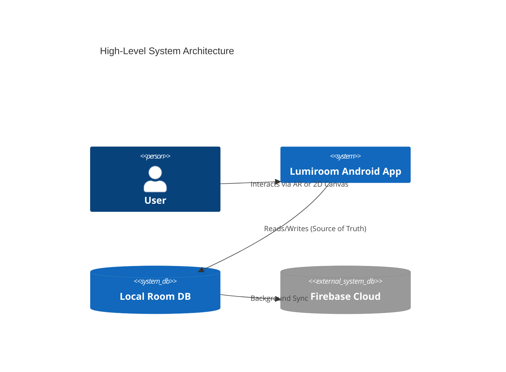

<p align="center"></p>

<h1 align="center">Lumiroom</h1>

<p align="center">AI-Assisted Mobile AR Furniture Visualization and Interior Planning System</p>

<p align="center">Visualize Furniture Before It Arrives</p>

<p align="center">
  
  
  
  
  
  
  <a href="https://opensource.org/licenses/MIT"></a>
</p>

Lumiroom is an enterprise-grade Android application that redefines how users plan and visualize interior spaces. By combining **ARCore** spatial tracking with a comprehensive **2D Room Planner** and an offline-capable architecture, Lumiroom provides a seamless interior design experience across multiple paradigms.

> [!NOTE]
> **AR Synchronization & AppCheck Update (v1.1.2):**
> Fixed Firebase AppCheck quirk where Android caches an overriding random debug token instead of parsing `strings.xml`. Resolved Filament `ModelLoader` swallowing `FileNotFoundException` by properly parsing native `file:///android_asset/` URIs without redundant prefixing.

---

## 📸 Screenshots

| AR Placement | Voice Commands | 2D Planning |
| :---: | :---: | :---: |
|  |  |  |

---

## 🚀 Key Features

### AR Mode

* **Plane Detection**: Intelligent identification of physical floors and walls.
* **Furniture Placement**: True-to-scale 3D asset rendering.
* **Selection & Transform**: Tap to select, drag to move, pinch to scale, and twist to rotate.
* **Anchors**: Spatially anchored objects using ARCore for drift-free stability.
* **Persistence**: AR sessions can be saved and restored with anchor states preserved.

### 2D Room Planner

* **Top-down Editor**: Precision planning in a distraction-free 2D grid.
* **Room Canvas**: Dynamic canvas that matches physical room dimensions.
* **Furniture Placement**: Easy drag-and-drop from the catalog.
* **Selection & Transform**: Full selection, rotation, and scaling in 2D space.
* **Minimap**: Quick navigation for large or complex floor plans.
* **Zoom & Pan**: Gesture-based canvas navigation.

### Synchronization

Bidirectional synchronization ensures that any change in AR is instantly reflected in 2D, and vice versa. This is achieved using a shared, reactive `RoomState`.

### Persistence

* **Room Saving**: Save designs locally to an SQLite database via Room.
* **Autosave**: Background autosave ensures no data loss during long sessions.
* **State Restoration**: Load projects seamlessly to continue editing.
* **Project Metadata**: Track creation dates, thumbnails, and author details.

### Catalog

* **Categories**: Organized furniture categories (e.g., Seating, Tables, Lighting).
* **Search**: Real-time filtering.
* **Preview Images**: High-quality 2D previews of 3D assets.

### Room Geometry

* **Plane Boundaries**: Mathematical models representing the detected physical boundaries.
* **Room Outlines**: Calculated geometry for walls, windows, and doors.
* **Corner Points**: Detected physical corners for snapping and measuring.

---

## 🏗️ Architecture Overview

Lumiroom uses a modern Android architecture based on **Unidirectional Data Flow (UDF)** and the **Repository Pattern**.

At the core of the application is the `RoomState`, which acts as the single source of truth for both AR and 2D views:

```text
RoomState
├── Walls
├── PlaneBoundary
├── Furniture
├── SelectionState
├── HistoryManager
├── CameraState
├── MinimapState
└── Metadata
```



---

## 📚 Documentation Directory

Lumiroom features a complete, international-standard documentation suite adhering to ISO/IEC/IEEE 42010 and IEEE 830.

| Document | Description |
| ----------- | ------------- |
| [Software Requirements Specification](docs/SRS.md) | IEEE 830 functional and non-functional requirements |
| [System Architecture](docs/Architecture.md) | ISO 42010 Architecture, Principles, and Patterns |
| [C4 Architecture Models](docs/C4Architecture.md) | System Context, Container, Component, and Deployment diagrams |
| [UML Diagrams Index](docs/UMLDiagrams.md) | Central hub for all UML models |
| [Database Design](docs/DatabaseDesign.md) | ER diagrams, Room schemas, and Firestore sync strategy |
| [Asset Pipeline](docs/AssetPipeline.md) | 3D Furniture asset optimization workflow |
| [Deployment Guide](docs/DeploymentGuide.md) | Build, signing, and CI/CD deployment |
| [FMP Integration Guide](docs/FMP_Integration_Guide.md) | Asset extraction and preprocessing process |
| [Implementation Plan](docs/implementation_plan.md) | Agile roadmap, WBS, and Gantt charts |
| [Testing Report](docs/TestingReport.md) | QA testing strategy, matrices, and coverage |
| [Use Cases](docs/UseCases.md) | Actor diagrams and use case narratives |
| [Sequence Diagrams](docs/SequenceDiagrams.md) | Time-ordered flow of operations |
| [Class Diagrams](docs/ClassDiagrams.md) | Domain and Data layer object structures |
| [ER Diagrams](docs/ERDiagrams.md) | Database Entity-Relationship diagrams |
| [Data Flow Diagrams](docs/DataFlowDiagrams.md) | System data processing pipelines |
| [State Machine Diagrams](docs/StateMachineDiagrams.md) | Lifecycle and application states |
| [Activity Diagrams](docs/ActivityDiagrams.md) | Process and logic workflows |
| [Deployment Diagrams](docs/DeploymentDiagrams.md) | Physical node distributions |
| [Security Architecture](docs/SecurityArchitecture.md) | Threat models, Trust boundaries, Auth flows |
| [API Reference](docs/APIReference.md) | Repository, ViewModel, and Service APIs |
| [Coding Standards](docs/CodingStandards.md) | Kotlin and Compose formatting guidelines |
| [Risk Assessment](docs/RiskAssessment.md) | Risk matrices and mitigation strategies |
| [Performance Analysis](docs/PerformanceAnalysis.md) | Benchmarking, rendering FPS, and memory limits |
| [Glossary](docs/Glossary.md) | Definitions and terminology |
| [Contributing Guide](docs/ContributingGuide.md) | Workflows for open-source contributors |
| [Changelog](docs/Changelog.md) | Version history |
| [Future Scope](docs/FutureScope.md) | Roadmap for future features |

---

## 🛠️ Technology Stack

* **Language**: Kotlin
* **UI Framework**: Jetpack Compose & Material 3
* **AR Engine**: SceneView & ARCore
* **Dependency Injection**: Hilt
* **Local Database**: Room (SQLite) & DataStore
* **Cloud Backend**: Firebase Firestore, Storage, & Authentication
* **AI Backend**: Google Vertex AI
* **Concurrency**: Kotlin Coroutines & Flow

---

## 📂 Folder Structure

```text
lumiroom/
├── app/                  # Application entry point and DI setup
├── core/                 # Shared logic, databases, UI themes, networks
├── feature/              # Independent feature modules (ar, room-planner, catalog, etc.)
├── docs/                 # ISO/IEEE compliant documentation suite
└── .github/workflows/    # CI/CD pipelines
```

---

## 💻 Installation & Build Guide

### Prerequisites

* **Android Studio Koala** (or newer)
* **JDK 17**
* An ARCore supported Android device (API 29+)

### Firebase Setup

1. Create a project in the [Firebase Console](https://console.firebase.google.com/).
2. Enable Firestore, Storage, and Authentication.
3. Replace `app/google-services.json.example` with your real `google-services.json`.

### Building the Project

```bash
git clone https://github.com/Vinoth-ai-20/lumiroom.git
cd lumiroom
./gradlew assembleDebug
```

---

## 🎙️ Voice Commands Guide

Activate the microphone and speak natural commands:

* *"Place a modern vanity here"* (Executes center-screen raycast)
* *"Rotate the sofa 90 degrees"*
* *"Remove this item"*
* *"Undo"*

---

## 📱 Supported Devices

Lumiroom requires a device with a Time-of-Flight (ToF) sensor or sufficient camera capabilities to support **Google ARCore Depth API**. Standard support begins at devices equivalent to the Google Pixel 4 / Samsung Galaxy S10 and newer.

---

## 🗺️ Roadmap

Please see our detailed [Implementation Plan](docs/implementation_plan.md) and [Future Scope](docs/FutureScope.md) for full roadmap details.

---

## 🤝 Contributing

We welcome contributions! Please see our [Contributing Guide](docs/ContributingGuide.md) and [Coding Standards](docs/CodingStandards.md) before submitting a Pull Request.

---

## 📜 License

This project is licensed under the MIT License - see the [LICENSE](LICENSE) file for details.

---

## 🙏 Acknowledgements

* [SceneView](https://github.com/SceneView/sceneview-android) for the incredible AR rendering engine.
* [Google ARCore](https://developers.google.com/ar) for spatial tracking.

---

## 📚 References

* ISO/IEC/IEEE 42010:2011, Systems and software engineering — Architecture description.
* IEEE Std 830-1998, IEEE Recommended Practice for Software Requirements Specifications.


## Asset-Driven Catalog Architecture (v12)
The furniture catalog is now completely dynamically generated from local assets.
No manual registration, hardcoded arrays, or JSON seeding is required.
During the application startup (specifically database creation), the system automatically scans the assets/models/ and assets/thumbnails/ directories.
It uses the naming convention roomType_category_variant.glb (e.g. bathroom_bathtub_01.glb) to dynamically generate metadata, categories, pricing, and tags. This forms the single source of truth for the entire application catalog, powering search, filters, and AR persistence.
