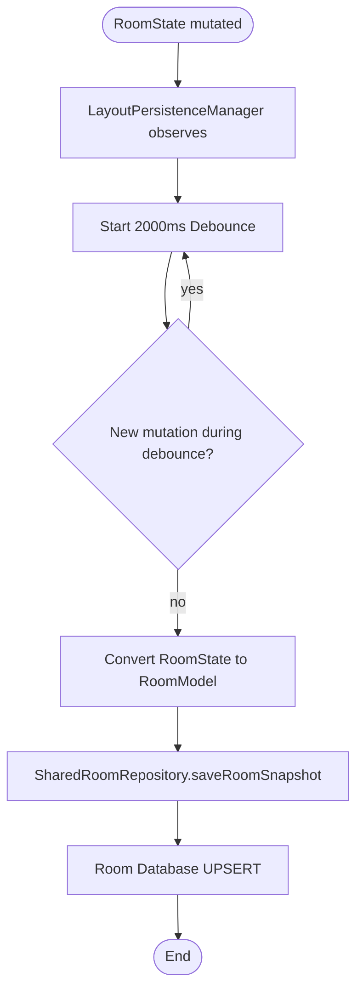
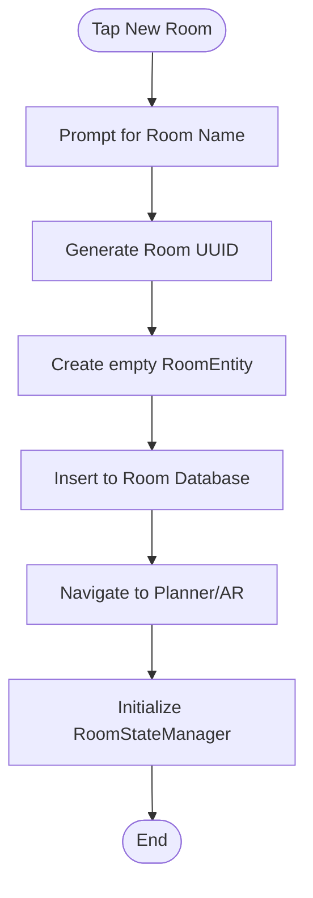
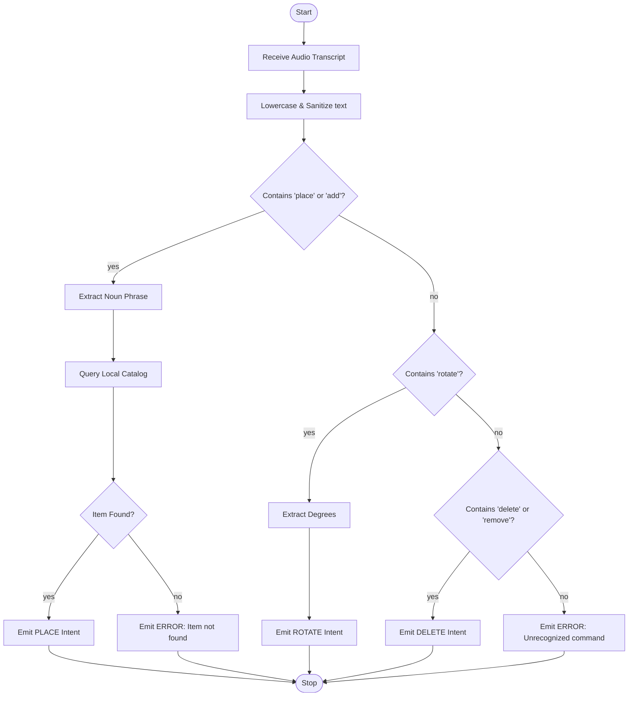

# Activity Diagrams

> [!NOTE]
> **Asset Integration & Pricing Update (v10):**
> Lumiroom has been updated to use a dynamic Model Discovery Engine. Hardcoded `furniture_seed.json` lists have been eliminated. Assets are automatically indexed from the `/assets/models` directory. All prices have been dynamically recalculated to reflect the realistic Indian Market pricing (₹).


**Project:** Lumiroom: AI-Assisted Mobile AR Furniture Visualization and Interior Planning System  
**Version:** 2.0  

[⬅ Back to State Machine Diagrams](StateMachineDiagrams.md) | [Next: Data Flow Diagrams](DataFlowDiagrams.md)

---

## 1. Furniture Placement Activity

```mermaid
flowchart TD
    A([Start Placement]) --> B{Is Source 2D or AR?}
    B -- AR --> C[Tap on screen]
    C --> D[ARCore HitTest]
    D --> E{Plane Found?}
    E -- no --> C
    
    B -- 2D --> F[Drag from Catalog]
    F --> G[Drop on Canvas]
    
    E -- yes --> H[Calculate World Position]
    G --> H
    
    H --> I[RoomStateManager.dispatch(AddItem)]
    I --> J[Generate UUID]
    J --> K[Mutate RoomState]
    K --> L[Emit StateFlow]
    L --> M([End])
```

---

## 2. Save Workflow (Autosave)



---

## 3. Delete Workflow

```mermaid
flowchart TD
    A([User taps Delete]) --> B{Item selected?}
    B -- no --> Z([End])
    
    B -- yes --> C[RoomStateManager.dispatch(RemoveItem)]
    C --> D[Snapshot Current State to History]
    D --> E[Filter items list]
    E --> F[Clear SelectionState]
    F --> G[Emit new RoomState]
    G --> Z
```

---

## 4. Room Creation



---

## 5. Undo / Redo

```mermaid
flowchart TD
    A([Tap Undo]) --> B[RoomStateManager.dispatch(Undo)]
    B --> C[UndoRedoManager.popPrevious()]
    C --> D{History Empty?}
    
    D -- yes --> Z([Ignore])
    
    D -- no --> E[Push current to Redo stack]
    E --> F[Set RoomState = previous]
    F --> G[Emit StateFlow]
    G --> Z
```

---

## 6. Voice Command Resolution Activity

Details the internal logic of the fuzzy-matching NLP parser.


