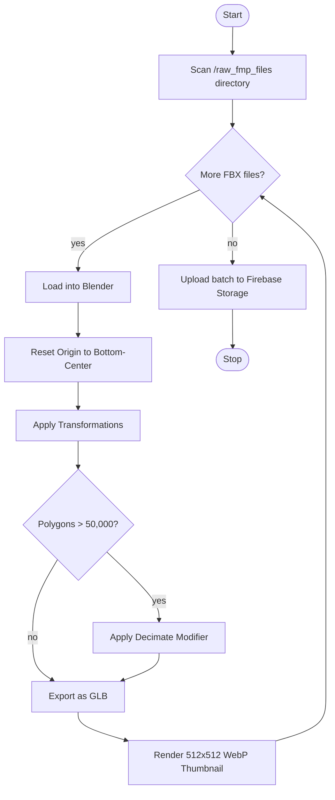

# Activity Diagrams

**Project:** Lumiroom: AI-Assisted Mobile AR Furniture Visualization and Interior Planning System  
**Version:** 1.0  
**Date:** 2026-06-10  

[⬅ Back to README](../README.md) | [Next: Deployment Diagrams](DeploymentDiagrams.md)

---

## 1. Voice Command Resolution Activity
Details the internal logic of the fuzzy-matching NLP parser.

## 2. FMP Batch Processing Activity
Details the workflow of the Python automation script used by developers.

