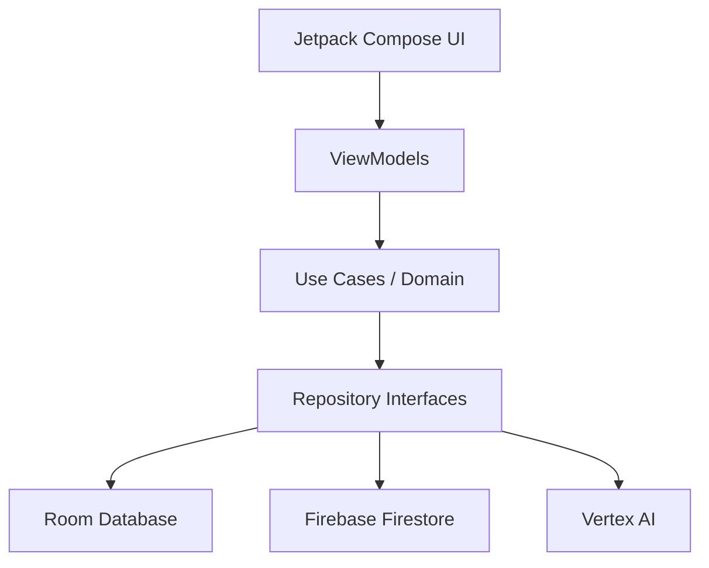

# System Architecture Document

## 1. Architectural Pattern
Lumiroom strictly adheres to **Clean Architecture** principles and the **Model-View-ViewModel (MVVM)** pattern recommended by Google. 

## 2. Layer Definitions

### 2.1 Presentation Layer (UI)
- Built exclusively with **Jetpack Compose**.
- State is hoisted and managed by **ViewModels**.
- UDF (Unidirectional Data Flow) is enforced using `StateFlow`.
- Navigation is handled via Jetpack Navigation Compose.

### 2.2 Domain Layer (`:core:domain`)
- Contains pure Kotlin business logic (`UseCase` classes).
- Interfaces with the Data Layer through abstract Repository interfaces.
- Manages cross-cutting concerns like the `SyncEngine` and `RoomAnalyticsManager`.

### 2.3 Data Layer (`:core:database`, `:core:network`, `:core:datastore`)
- **Local Database (Source of Truth):** Room Database.
- **Remote Database:** Firebase Firestore.
- **Local Preferences:** DataStore.
- **Repository Implementations:** Handle the caching and synchronization logic between local Room and remote Firestore.

## 3. High-Level Component Diagram

## 4. Feature Modules
- `:feature:ar` - ARCore SceneView implementation.
- `:feature:ai-assistant` - Conversational Gemini interface.
- `:feature:room-planner` - 2D Canvas layout editor.
- `:feature:catalog` - Furniture browsing and GLB downloading.
- `:feature:voice` - SpeechRecognizer parsing engine.

## 5. Dependency Injection
Lumiroom uses **Hilt** to inject dependencies across all layers, ensuring loose coupling and high testability.
