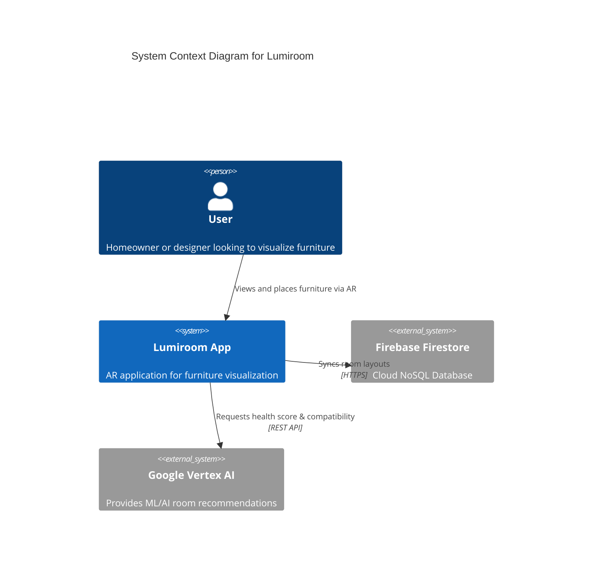
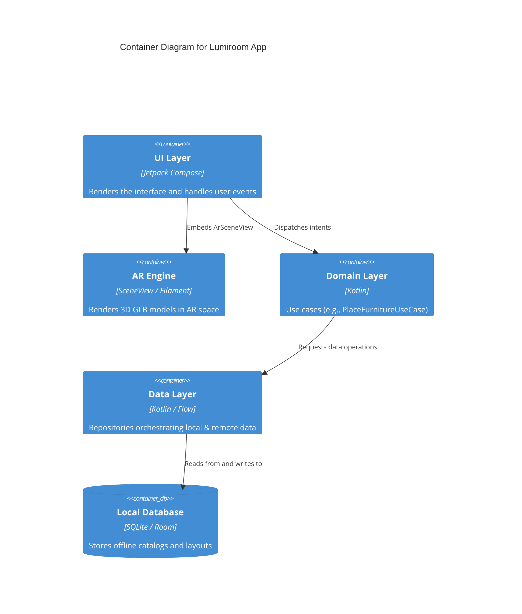
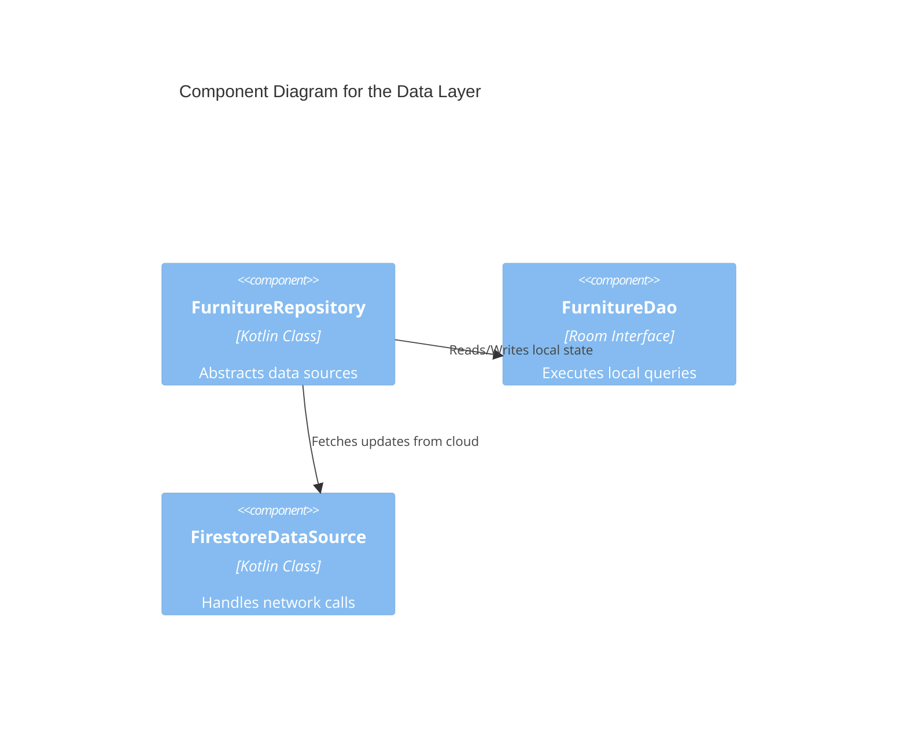
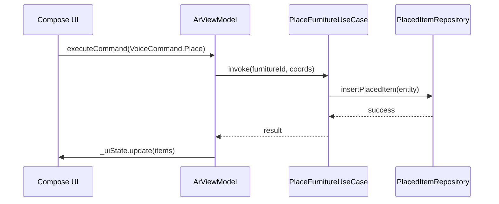
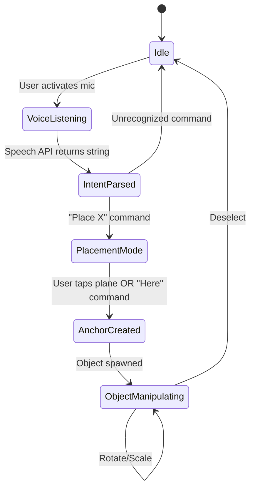

# Software Architecture Description

**Project Title:** Lumiroom: AI-Assisted Mobile AR Furniture Visualization and Interior Planning System  
**Version:** 1.0  
**Date:** 2026-06-10  

---

## 1. Introduction and Architectural Principles

The architecture of Lumiroom strictly follows modern Android development principles, heavily leaning on **Unidirectional Data Flow (UDF)**, **Dependency Injection**, and the **Repository Pattern**. It is designed with an offline-first philosophy to ensure responsiveness.

### 1.1 Key Principles
- **Separation of Concerns**: UI, Domain, and Data layers are strictly decoupled.
- **Offline-First**: All state modifications happen against local Room databases first, syncing with Firestore asynchronously.
- **Reactive State**: Jetpack Compose observes Kotlin `StateFlow` streams exposed by `ViewModel`s.

---

## 2. C4 Model Diagrams

### 2.1 System Context Diagram

### 2.2 Container Diagram

### 2.3 Component Diagram (Data Layer)

---

## 3. Detailed UML Diagrams

### 3.1 MVVM / Unidirectional Data Flow

### 3.2 State Machine Diagram: AR Placement Mode

---

## 4. Architectural Decisions (ADRs)

- **ADR-001: SceneView over ArSceneform**: SceneView provides native Kotlin APIs and active maintainership compared to the deprecated ArSceneform.
- **ADR-002: Offline-First SQLite**: Ensures AR experience does not stutter or fail in dead zones inside homes.
- **ADR-003: Hilt over Koin**: Compile-time safety for dependency injection is preferred in a multi-module architecture.
