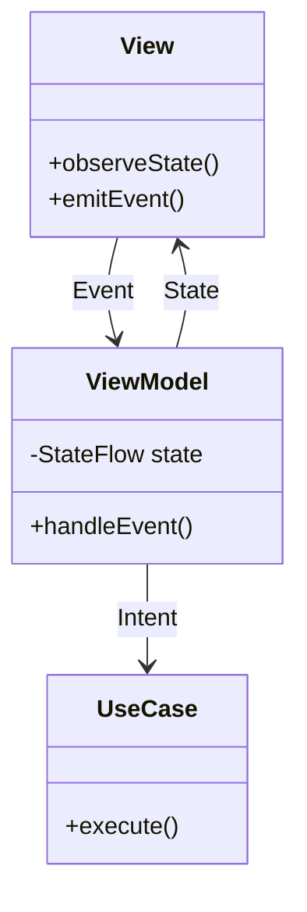
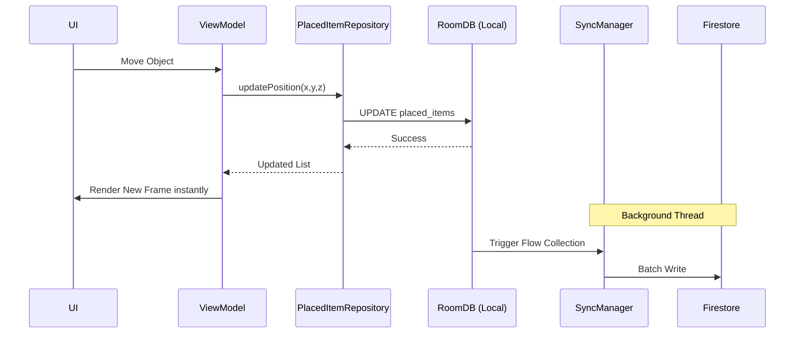

# System Architecture

**Project:** Lumiroom: AI-Assisted Mobile AR Furniture Visualization and Interior Planning System  
**Document Standard:** ISO/IEC/IEEE 42010  
**Version:** 1.0  
**Date:** 2026-06-10  

[⬅ Back to README](../README.md) | [Next: C4 Architecture](C4Architecture.md)

---

## 1. Architecture Principles
The architecture of Lumiroom is driven by three core philosophies:
1. **Unidirectional Data Flow (UDF)**: State flows down, events flow up. The UI is a pure function of the state.
2. **Offline-First Robustness**: The application must never block the UI waiting for a network request. All changes are written to a local database first.
3. **Separation of Concerns**: Strict boundary enforcement between the UI (Compose), Domain (Use Cases), and Data (Repositories) layers via Clean Architecture.

---

## 2. Architectural Decisions (ADRs)

| ADR ID | Decision | Rationale | Status |
|--------|----------|-----------|--------|
| ADR-01 | **SceneView over ArSceneform** | SceneView provides native Kotlin, filament integration, and active maintenance. | Accepted |
| ADR-02 | **Room + Firestore Hybrid** | Relying entirely on Firestore limits AR performance in low-connectivity. SQLite ensures instant rendering. | Accepted |
| ADR-03 | **Hilt Dependency Injection** | Hilt integrates cleanly with ViewModels and Navigation Compose, providing compile-time safety. | Accepted |
| ADR-04 | **Jetpack Compose UI** | Eliminates XML overhead and enforces UDF state management natively. | Accepted |

---

## 3. Quality Attributes
- **Maintainability**: Enforced via multi-module architecture (`app`, `core`, `feature:ar`, `feature:voice`).
- **Testability**: Interfaces are heavily used in the Data layer, allowing Mockk-based unit testing for ViewModels.
- **Performance**: Heavy rendering tasks are offloaded to native C++ Filament libraries.

---

## 4. Patterns Used

### 4.1 MVVM (Model-View-ViewModel)
ViewModels act as StateHolders, exposing `StateFlow` and handling `Events`.

### 4.2 Repository Pattern
Repositories orchestrate data between Room (Local) and Firebase (Remote).

### 4.3 Dependency Injection
Hilt modules provide singletons for `RoomDatabase`, `FirebaseAuth`, and Repositories.

---

## 5. Offline-First Design

---

## 6. Related Documents
- View comprehensive architecture diagrams in [C4 Architecture](C4Architecture.md).
- View precise state handling in [State Machine Diagrams](StateMachineDiagrams.md).
