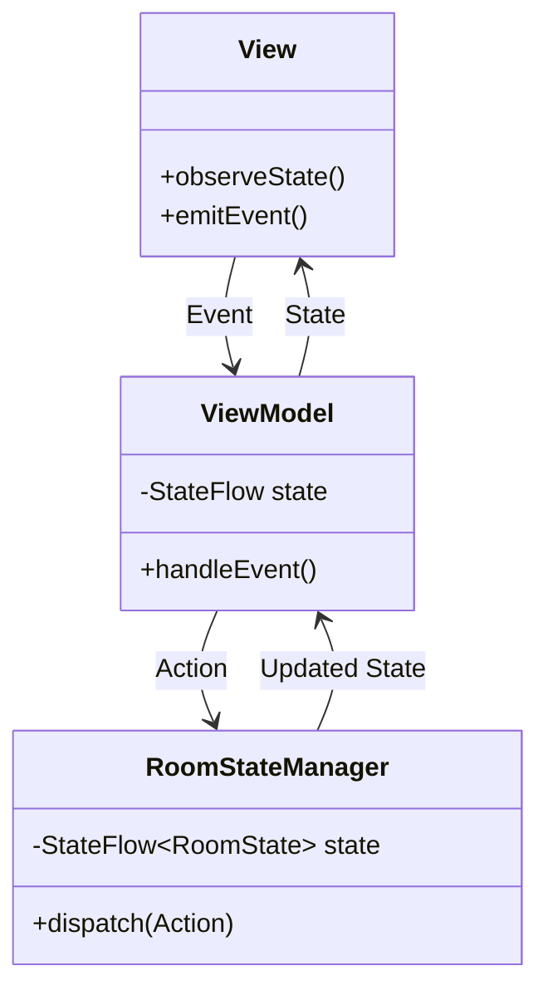
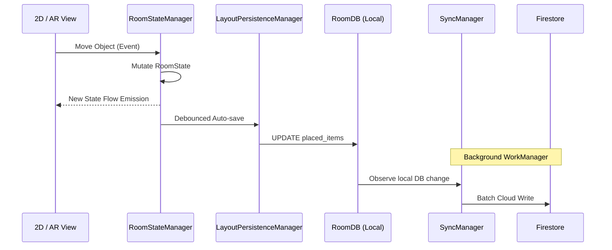

  

# System Architecture

> [!NOTE]
> **Asset Integration & Pricing Update (v10):**
> Lumiroom has been updated to use a dynamic Model Discovery Engine. Hardcoded `furniture_seed.json` lists have been eliminated. Assets are automatically indexed from the `/assets/models` directory. All prices have been dynamically recalculated to reflect the realistic Indian Market pricing (₹).
>
> **AR Synchronization & AppCheck Update (v1.1.1):**
> Addressed Firebase AppCheck initialization failures by applying `DebugAppCheckProviderFactory` on debug builds. AR placement stability is improved by correctly persisting tracking anchors and synchronizing Y/Z axes with the 2D planner.

**Project:** Lumiroom: AI-Assisted Mobile AR Furniture Visualization and Interior Planning System  
**Document Standard:** ISO/IEC/IEEE 42010  
**Version:** 2.0  

[⬅ Back to README](../README.md) | [Next: C4 Architecture](C4Architecture.md)

---

## 1. Architecture Principles

The architecture of Lumiroom is driven by three core philosophies:

1. **Unidirectional Data Flow (UDF)**: State flows down, events flow up. The UI is a pure function of the state.
2. **Offline-First Robustness**: The application must never block the UI waiting for a network request. All changes are written to a local database first.
3. **Separation of Concerns**: Strict boundary enforcement between the UI (Compose), Domain (Use Cases), and Data (Repositories) layers via Clean Architecture.
4. **Shared State Centralization**: Both AR and 2D canvas paradigms rely on a single, shared source of truth (`RoomState`).

---

## 2. Architectural Decisions (ADRs)

| ADR ID | Decision | Rationale | Status |
|--------|----------|-----------|--------|
| ADR-01 | **SceneView over ArSceneform** | SceneView provides native Kotlin, filament integration, and active maintenance. | Accepted |
| ADR-02 | **Room + Firestore Hybrid** | Relying entirely on Firestore limits AR performance in low-connectivity. SQLite ensures instant rendering. | Accepted |
| ADR-03 | **Hilt Dependency Injection** | Hilt integrates cleanly with ViewModels and Navigation Compose, providing compile-time safety. | Accepted |
| ADR-04 | **Jetpack Compose UI** | Eliminates XML overhead and enforces UDF state management natively. | Accepted |
| ADR-05 | **Shared `RoomState`** | AR and 2D planner share a single `RoomStateManager` to ensure instantaneous synchronization across paradigms. | Accepted |

---

## 3. Subsystem Architecture

Lumiroom is composed of several high-level, semi-autonomous subsystems that orchestrate data flow.

### 3.1 Shared State Subsystem (`core/domain`)
The `RoomStateManager` acts as the reactive brain of a room design session. 
- It maintains the unified `RoomState` containing all entities (Furniture, Walls, Boundaries, Selections).
- It prevents logic duplication between AR and 2D features.

### 3.2 AR Subsystem (`feature/ar`)
Powered by ARCore and SceneView.
- `LumiroomArSessionManager`: Manages AR hit tests, plane detection, anchors, and camera transforms.
- Converts 3D physical coordinates into the logical `RoomCoordinateSystem`.

### 3.3 2D Planner Subsystem (`feature/room-planner`)
A top-down 2D canvas editor.
- Built entirely in Compose Canvas.
- Re-renders instantly based on emissions from the `RoomStateManager`.
- Supports pan, zoom, and interactive object selection.

### 3.4 Synchronization Layer
`SyncManager` (`core/domain/sync`) handles bidirectional background synchronization between local `Room` databases and `Firestore`. It uses WorkManager for reliable scheduling when offline.

---

## 4. Patterns Used

### 4.1 MVI / MVVM
ViewModels act as StateHolders, exposing `StateFlow` and handling user `Events`.

### 4.2 Repository Pattern
Repositories (`SharedRoomRepository`, `FurnitureRepository`) orchestrate data between `RoomDatabase` (Local), DataStore, and `Firestore` (Remote).

### 4.3 Dependency Injection
Hilt modules provide singletons for databases, auth, managers, and repositories across a highly modularized structure (`app`, `core:*`, `feature:*`).

---

## 5. Event Flow and State Management

State management strictly follows UDF:

1. **User Action**: User moves an item in the 2D planner.
2. **Event Emission**: `RoomPlannerViewModel` calls `RoomStateManager.moveItem()`.
3. **State Mutation**: `RoomStateManager` updates the in-memory `RoomState`.
4. **State Emission**: Both `RoomPlannerViewModel` and `ArViewModel` instantly receive the new `RoomState` via `StateFlow`.
5. **Persistence Trigger**: `LayoutPersistenceManager` intercepts the state change and asynchronously writes it to the local SQLite database.

---

## 6. Related Documents

- View comprehensive architecture diagrams in [C4 Architecture](C4Architecture.md).
- View precise state handling in [State Machine Diagrams](StateMachineDiagrams.md).
- View specific module architecture in [Repository Structure](RepositoryStructure.md).

## Asset-Driven Catalog Architecture (v12)
The furniture catalog is now completely dynamically generated from local assets.
No manual registration, hardcoded arrays, or JSON seeding is required.
During the application startup (specifically database creation), the system automatically scans the assets/models/ and assets/thumbnails/ directories.
It uses the naming convention roomType_category_variant.glb (e.g. bathroom_bathtub_01.glb) to dynamically generate metadata, categories, pricing, and tags. This forms the single source of truth for the entire application catalog, powering search, filters, and AR persistence.
