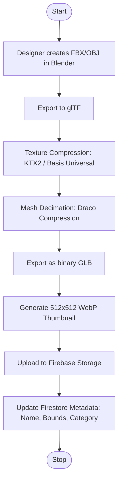
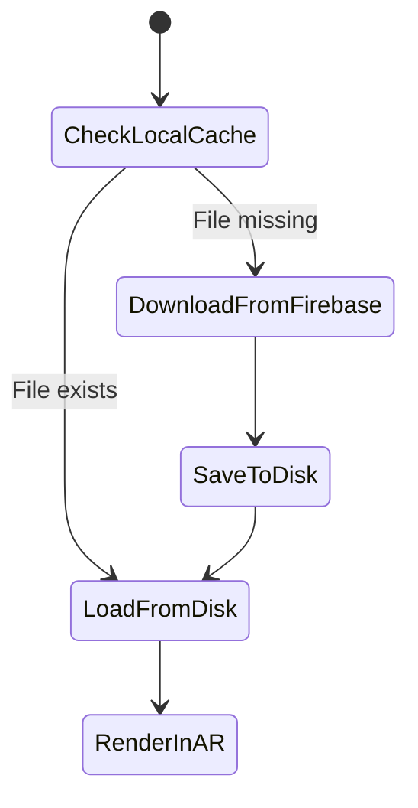

  

# Asset Pipeline Documentation

**Project:** Lumiroom: AI-Assisted Mobile AR Furniture Visualization and Interior Planning System  
**Version:** 1.0  
**Date:** 2026-06-10  

[⬅ Back to README](../README.md) | [Next: FMP Integration Guide](FMP_Integration_Guide.md)

---

## 1. Introduction
High-quality 3D assets are central to the Lumiroom AR experience. The Asset Pipeline defines the automated and manual processes for importing, optimizing, compressing, and caching 3D models from the Furniture Mega Pack (FMP) into the Android application.

## 2. Asset Pipeline Workflow

## 3. Optimization Strategy

### 3.1 Mesh Optimization
- **Polygon Count**: Strict limit of 50,000 polygons per model to ensure 30+ FPS rendering on mobile devices.
- **Draco Compression**: Applied to all `.glb` models to drastically reduce file size before network transmission.

### 3.2 Texture Pipeline
- All textures are baked into BaseColor, Normal, and ORM (Occlusion/Roughness/Metallic) maps.
- **Resolution Limit**: 1024x1024 maximum texture resolution.
- **Format**: Textures are compressed using KTX2 formatting to minimize GPU memory footprint during AR rendering.

## 4. Caching and Loading Strategy

### 4.1 Local File Caching

### 4.2 Memory Management
- Models are loaded asynchronously via Kotlin Coroutines.
- If memory pressure is detected (`onTrimMemory`), unused cached models in RAM are explicitly released by SceneView.

## 5. Naming Conventions
All assets must follow the `Category_Brand_ModelName.glb` structure (e.g., `Sofa_Ikea_Kivik.glb`).

