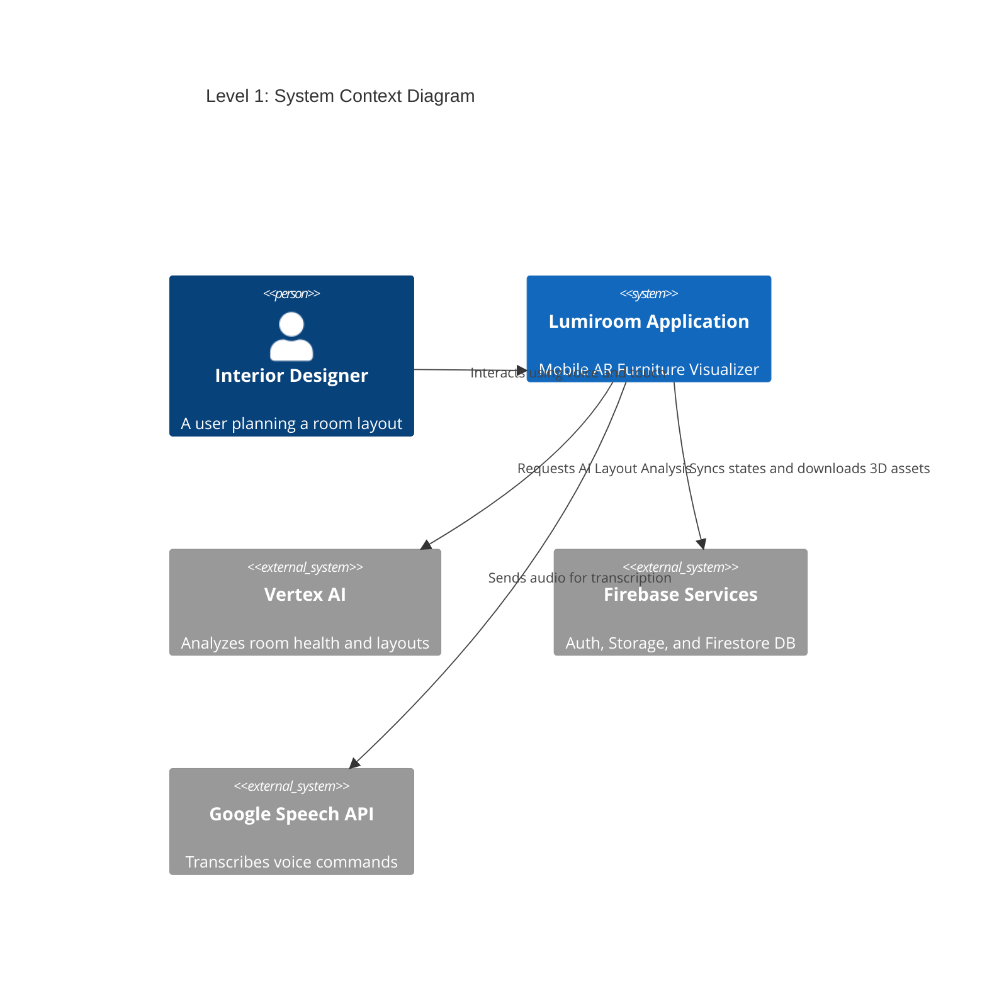
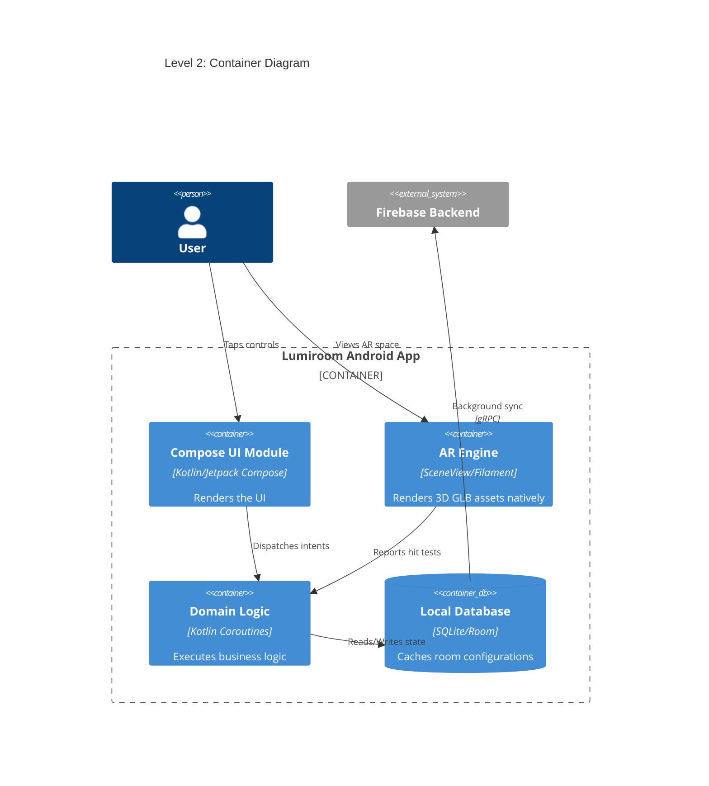
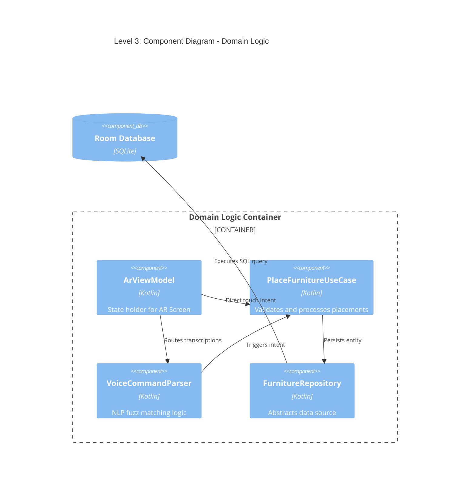

# C4 Architecture Models

**Project:** Lumiroom: AI-Assisted Mobile AR Furniture Visualization and Interior Planning System  
**Version:** 1.0  
**Date:** 2026-06-10  

[⬅ Back to README](../README.md) | [Next: Sequence Diagrams](SequenceDiagrams.md)

---

## 1. Level 1: System Context Diagram
Shows the system in relation to the user and external dependencies.

---

## 2. Level 2: Container Diagram
Breaks down the Lumiroom Application into executable/deployable units.

---

## 3. Level 3: Component Diagram (Domain Logic Container)
Breaks down the Domain Logic container.

