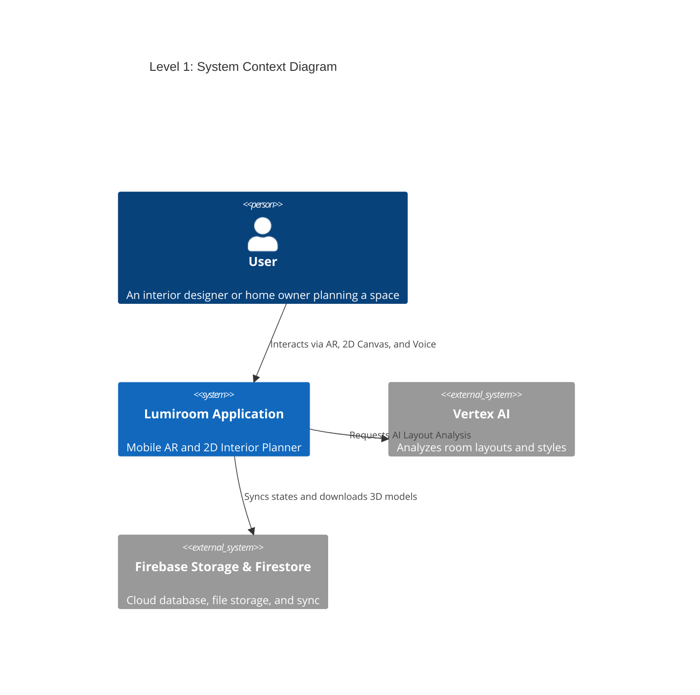
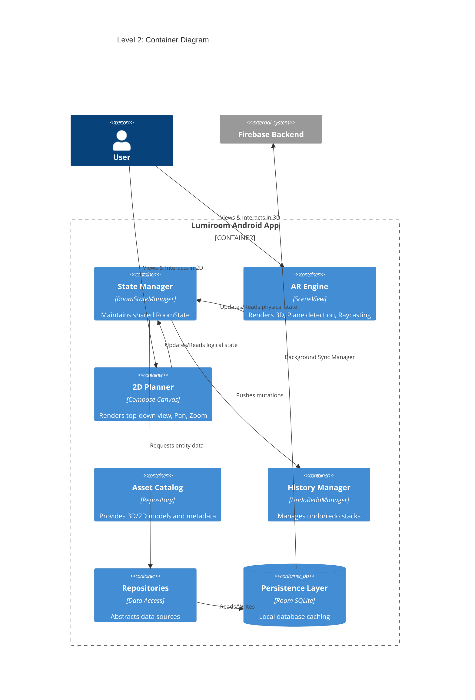
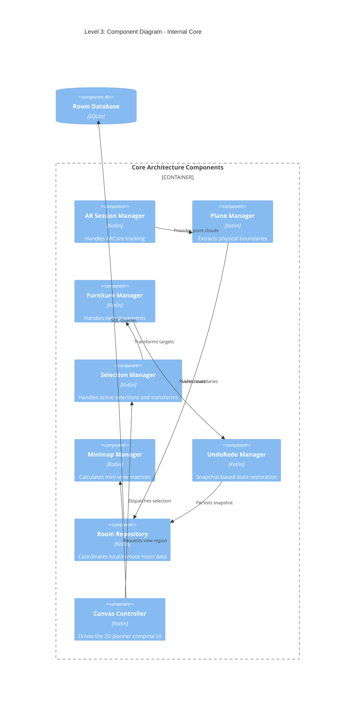

# C4 Architecture Models

**Project:** Lumiroom: AI-Assisted Mobile AR Furniture Visualization and Interior Planning System  
**Version:** 2.0  

[⬅ Back to README](../README.md) | [Next: Sequence Diagrams](SequenceDiagrams.md)

---

## 1. Level 1: System Context Diagram

Shows the system in relation to the user and external dependencies.

---

## 2. Level 2: Container Diagram

Breaks down the Lumiroom Application into distinct operational containers.

---

## 3. Level 3: Component Diagram

Focusing on the internal architecture of the Core Logic.

