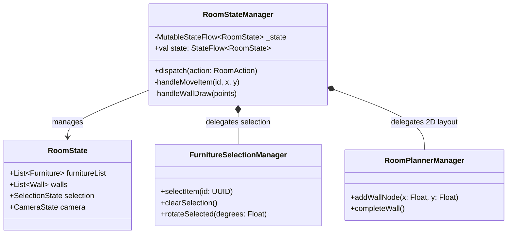
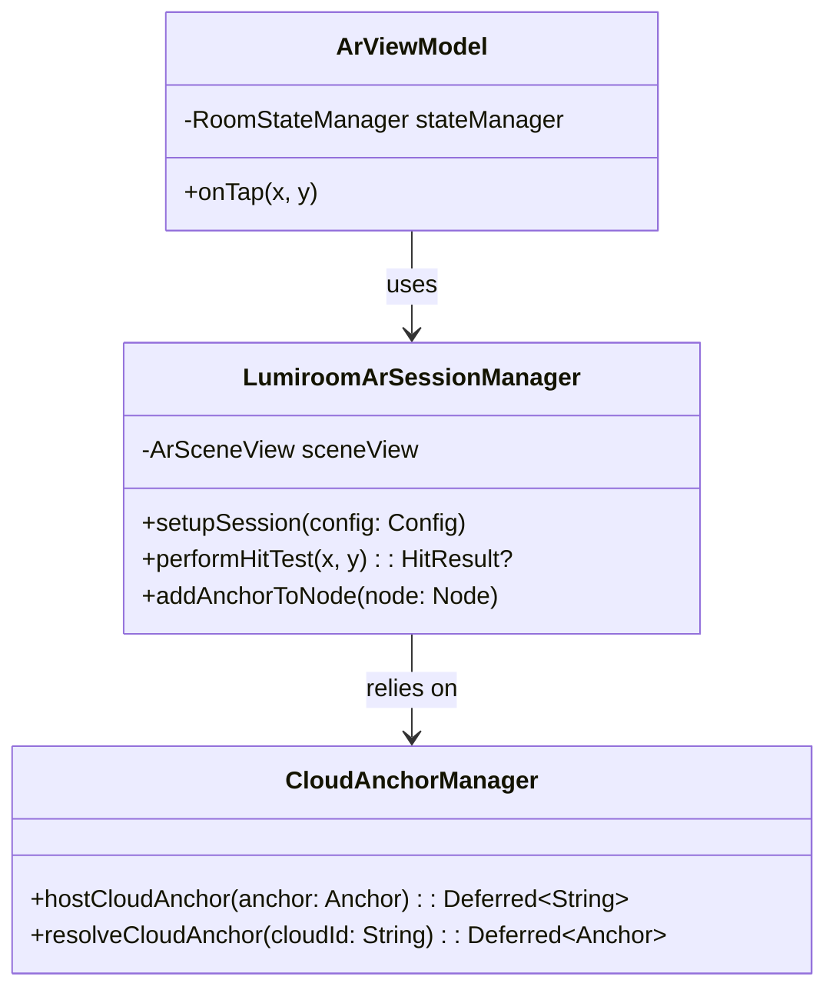
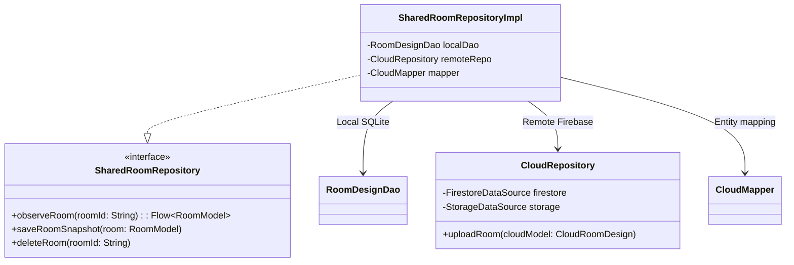
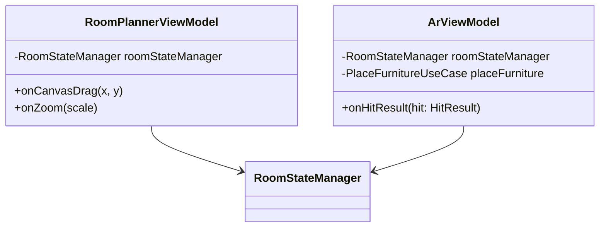

# Class Diagrams

> [!NOTE]
> **Asset Integration & Pricing Update (v10):**
> Lumiroom has been updated to use a dynamic Model Discovery Engine. Hardcoded `furniture_seed.json` lists have been eliminated. Assets are automatically indexed from the `/assets/models` directory. All prices have been dynamically recalculated to reflect the realistic Indian Market pricing (₹).

**Project:** Lumiroom: AI-Assisted Mobile AR Furniture Visualization and Interior Planning System  
**Version:** 2.0  

[⬅ Back to README](../README.md) | [Next: ER Diagrams](ERDiagrams.md)

---

## 1. Domain Layer: Shared State Architecture

Demonstrates how the `RoomStateManager` serves as the central brain for both AR and 2D views, preventing logic duplication.

---

## 2. AR Engine Layer

Shows how ARCore and SceneView are abstracted from the ViewModels.

---

## 3. Data Layer Repository Pattern

Shows the abstraction of Local and Remote data sources and synchronization.

---

## 4. UI Layer ViewModels

