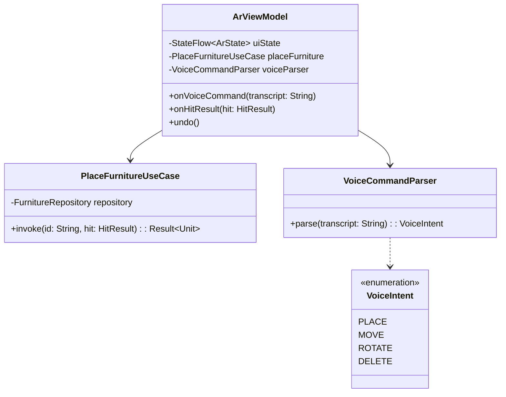
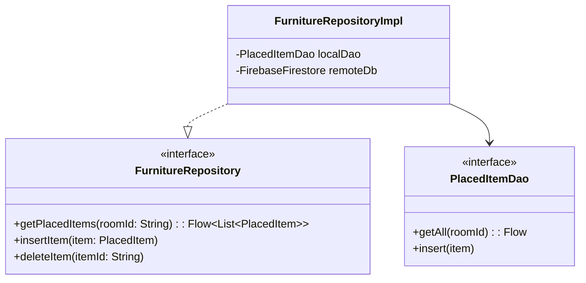

# Class Diagrams

**Project:** Lumiroom: AI-Assisted Mobile AR Furniture Visualization and Interior Planning System  
**Version:** 1.0  
**Date:** 2026-06-10  

[⬅ Back to README](../README.md) | [Next: ER Diagrams](ERDiagrams.md)

---

## 1. Domain Layer Class Diagram
Demonstrates the separation between presentation state holders (ViewModels) and business logic (UseCases).

---

## 2. Data Layer Repository Pattern
Shows the abstraction of Local and Remote data sources.

