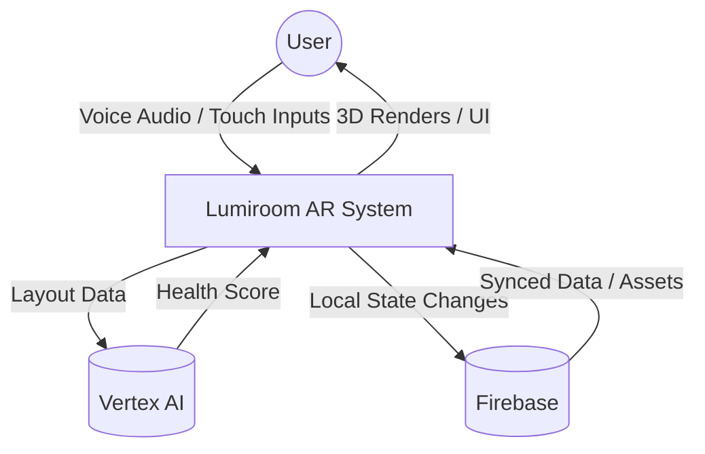
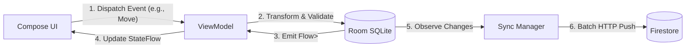

# Data Flow Diagrams (DFD)

**Project:** Lumiroom: AI-Assisted Mobile AR Furniture Visualization and Interior Planning System  
**Version:** 1.0  
**Date:** 2026-06-10  

[⬅ Back to README](../README.md) | [Next: State Machine Diagrams](StateMachineDiagrams.md)

---

## 1. Level 0: Context Data Flow
High-level data inputs and outputs.

---

## 2. Level 1: Core Processing DFD

