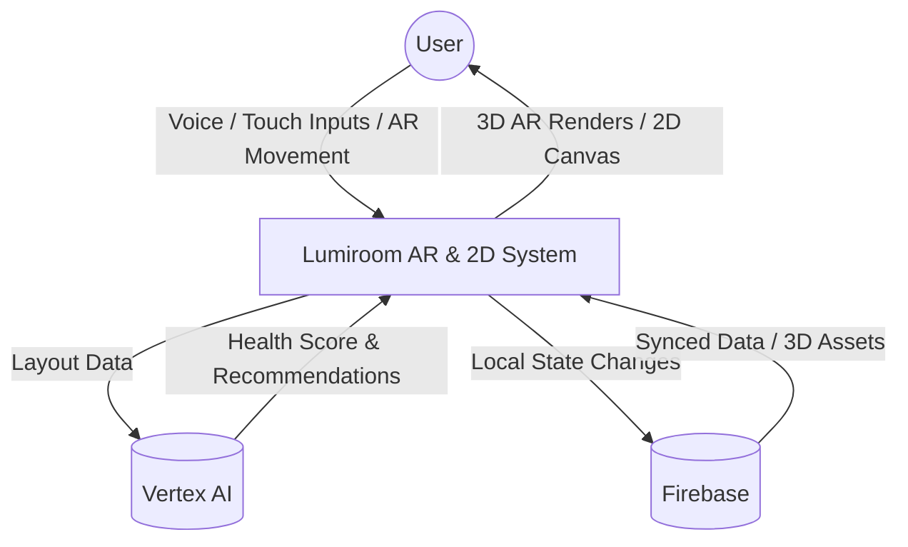
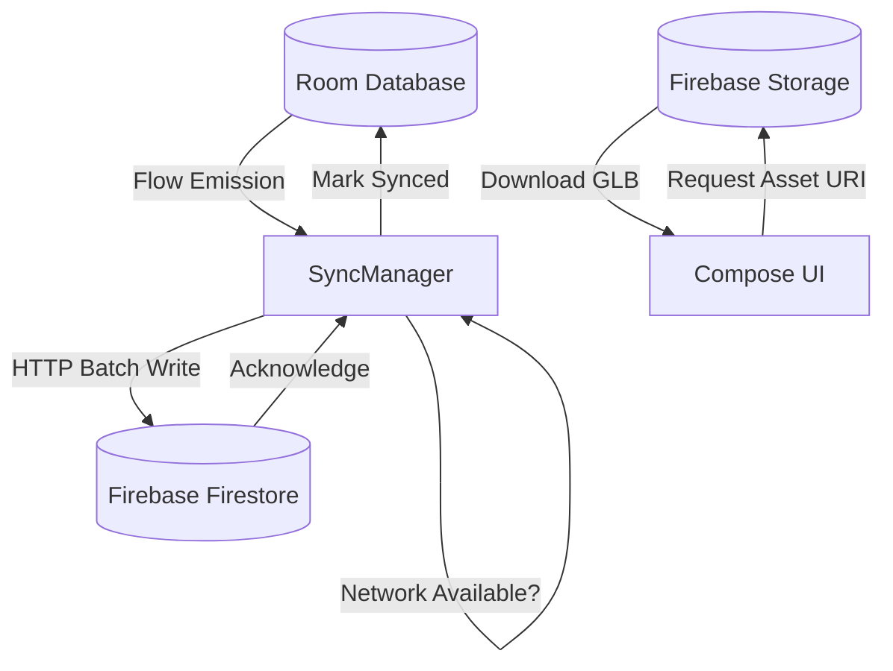

# Data Flow Diagrams (DFD)

**Project:** Lumiroom: AI-Assisted Mobile AR Furniture Visualization and Interior Planning System  
**Version:** 2.0  

[⬅ Back to Activity Diagrams](ActivityDiagrams.md) | [Next: Event Flow](EventFlow.md)

---

## 1. Level 0: Context Data Flow

High-level data inputs and outputs.



---

## 2. Level 1: Core Processing DFD (UDF Loop)

This diagram shows how user input strictly flows through the state manager to persistence, before looping back to the renderers.

```mermaid
flowchart LR
    UserInput[User Input (Touch/Drag)]
    SM[RoomStateManager]
    Repo[SharedRoomRepository]
    DB[(Room SQLite)]
    AR[AR Renderer]
    P2D[2D Canvas Renderer]

    UserInput -- "1. Dispatch Action" --> SM
    SM -- "2. Mutate Memory State" --> SM
    SM -- "3. Debounced Auto-save" --> Repo
    Repo -- "4. UPSERT Entities" --> DB
    
    SM -- "5. Emit StateFlow" --> AR
    SM -- "5. Emit StateFlow" --> P2D
```

---

## 3. Level 2: Component Interaction DFD

A deeper look at the data flow during a synchronization event.


