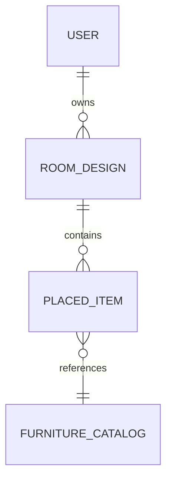

  

# Database Design

**Project:** Lumiroom: AI-Assisted Mobile AR Furniture Visualization and Interior Planning System  
**Version:** 1.0  
**Date:** 2026-06-10  

[⬅ Back to README](../README.md) | [Next: ER Diagrams](ERDiagrams.md)

---

## 1. Overview
Lumiroom uses a hybrid data architecture combining Android Room Database (SQLite) for instantaneous local reads/writes and Firebase Firestore for cross-device cloud synchronization.

---

## 2. ER Diagram (High Level)
For detailed relationships, see [ER Diagrams](ERDiagrams.md).

---

## 3. Room Database Schema (Local SQLite)

### 3.1 `furniture_catalog`
| Column | Type | Constraints | Description |
|--------|------|-------------|-------------|
| `id` | TEXT | PK | UUID of the 3D model |
| `name` | TEXT | NOT NULL | Human readable name |
| `category` | TEXT | NOT NULL | Furniture category |
| `glb_uri` | TEXT | NOT NULL | Path to 3D asset |

### 3.2 `room_designs`
| Column | Type | Constraints | Description |
|--------|------|-------------|-------------|
| `id` | TEXT | PK | UUID of the room |
| `user_id` | TEXT | NOT NULL | Firebase Auth UID |
| `name` | TEXT | NOT NULL | Custom room name |
| `updated_at` | INTEGER | NOT NULL | Sync timestamp |

### 3.3 `placed_items`
| Column | Type | Constraints | Description |
|--------|------|-------------|-------------|
| `id` | TEXT | PK | UUID of the placed instance |
| `room_id` | TEXT | FK | References `room_designs` |
| `furniture_id`| TEXT | FK | References `furniture_catalog` |
| `pos_x`, `pos_y`, `pos_z` | REAL | NOT NULL | World-space coordinates |
| `rot_x`, `rot_y`, `rot_z`, `rot_w` | REAL | NOT NULL | Quaternion rotation |
| `scale_x`, `scale_y`, `scale_z` | REAL | NOT NULL | Scale factors |

---

## 4. Firestore Collections (Cloud)

### 4.1 `/users/{userId}/rooms/{roomId}`
Mirrors the `room_designs` schema. Contains a `subcollection`:
- `/users/{userId}/rooms/{roomId}/items/{itemId}`: Mirrors the `placed_items` schema.

---

## 5. Offline Sync Strategy

Lumiroom implements a **Last-Write-Wins** synchronization strategy.

1. **Local Writes**: All user actions (move, rotate, scale) are written directly to Room.
2. **Observation**: `SyncManager` observes Room tables via Kotlin `Flow`.
3. **Batching**: On table change, `SyncManager` debounces for 2 seconds, then generates a Firestore `WriteBatch`.
4. **Offline Resolution**: If the device is offline, Firestore SDK handles local queueing natively. When connectivity restores, the queue flushes automatically.

---

## 6. Migration Strategy
Migrations are handled via Room's automated `Migration` classes.
When altering schemas, the version number is incremented, and an explicit `Migration(x, y)` function executing `ALTER TABLE` SQL commands is provided to prevent destructive data loss during app updates.

---

## 7. Backup Strategy
- **Local**: Android Auto Backup handles storing SQLite files in Google Drive.
- **Cloud**: Firebase Firestore automated daily backups are enabled in the Google Cloud Console.

