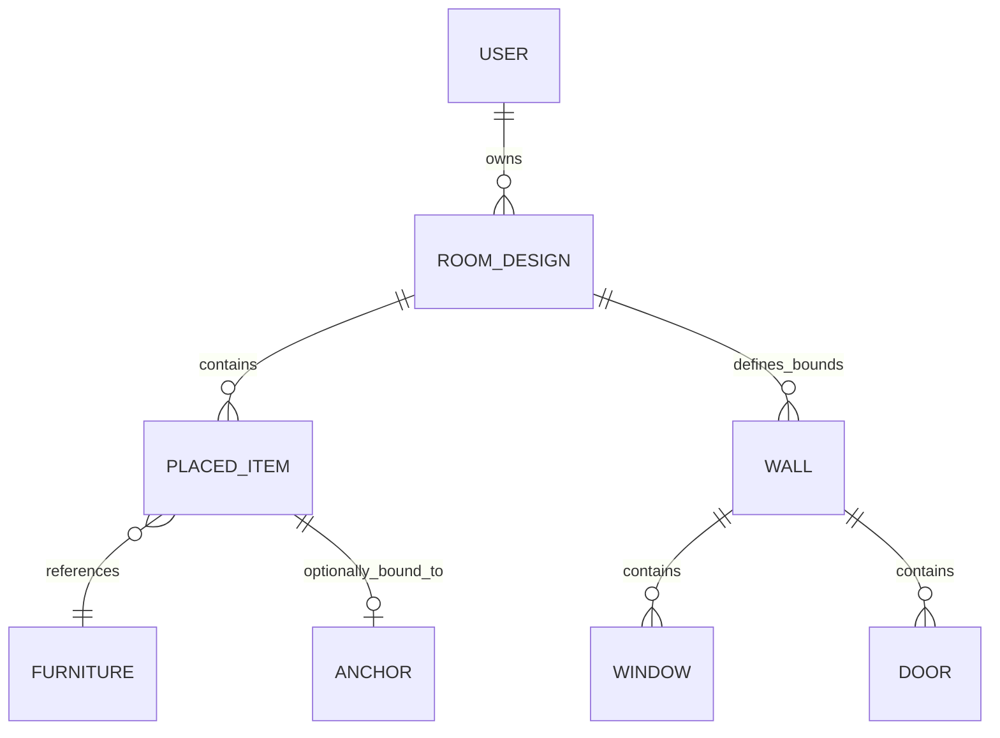

  

# Database Design

**Project:** Lumiroom: AI-Assisted Mobile AR Furniture Visualization and Interior Planning System  
**Version:** 2.0  

[⬅ Back to README](../README.md) | [Next: ER Diagrams](ERDiagrams.md)

---

## 1. Overview

Lumiroom utilizes a highly structured, relational SQLite database via Android Room, combined with Firebase Firestore for synchronization. The database is designed to store complex room geometries (walls, doors, windows), placed 3D furniture models, AR anchor data, and project metadata.

---

## 2. ER Diagram (High Level)

---

## 3. Core Entities (Room SQLite)

### 3.1 `RoomEntity` / `RoomDesignEntity`
Stores the metadata and configuration of a specific project.
- **`id`** (UUID, PK)
- **`name`** (String)
- **`user_id`** (String, FK)
- **`created_at`** (Timestamp)
- **`updated_at`** (Timestamp)
- **`thumbnail_path`** (String)

### 3.2 `FurnitureEntity`
The catalog cache representing 3D/2D models available for placement.
- **`id`** (UUID, PK)
- **`name`** (String)
- **`category`** (String)
- **`glb_url`** (String)
- **`dimensions`** (Vector3)

### 3.3 `PlacedItemEntity`
An instantiated piece of furniture placed inside a room.
- **`id`** (UUID, PK)
- **`room_id`** (UUID, FK)
- **`furniture_id`** (UUID, FK)
- **`pos_x`, `pos_y`, `pos_z`** (Real): Physical position.
- **`rot_x`, `rot_y`, `rot_z`, `rot_w`** (Real): Quaternion rotation.
- **`scale_x`, `scale_y`, `scale_z`** (Real): Current scaling.

### 3.4 `WallEntity`
Represents physical boundaries of the room detected by AR or drawn in the 2D planner.
- **`id`** (UUID, PK)
- **`room_id`** (UUID, FK)
- **`start_x`, `start_y`** (Real): Start corner coordinates.
- **`end_x`, `end_y`** (Real): End corner coordinates.
- **`thickness`** (Real)
- **`height`** (Real)

### 3.5 `CornerPointEntity`
Nodes connecting `WallEntity` items, allowing the 2D planner to snap walls together.
- **`id`** (UUID, PK)
- **`room_id`** (UUID, FK)
- **`x`, `y`** (Real)

### 3.6 `AnchorEntity`
Stores ARCore cloud anchor IDs or local anchor UUIDs associated with specific placed items to persist AR drift correction.
- **`id`** (UUID, PK)
- **`item_id`** (UUID, FK)
- **`cloud_anchor_id`** (String)
- **`pose_data`** (Blob)

### 3.7 `MetadataEntity`
Stores auxiliary data for the room (e.g., target budget, defined style, user notes).
- **`room_id`** (UUID, PK)
- **`budget`** (Real)
- **`style_preference`** (String)

---

## 4. Firestore Synchronization Strategy

### 4.1 Hybrid Cloud Data Model
Firestore mirrors the Room relational model using Subcollections to prevent massive document payloads.

- `/users/{userId}/rooms/{roomId}` (Mirrors `RoomEntity` + `MetadataEntity`)
  - `.../items/{itemId}` (Mirrors `PlacedItemEntity` + `AnchorEntity`)
  - `.../walls/{wallId}` (Mirrors `WallEntity`)

### 4.2 Offline Sync Strategy
Lumiroom implements a **Last-Write-Wins** synchronization strategy driven by `SyncManager`.

1. **Local Writes**: All user actions (move, rotate, scale, draw wall) are written directly to Room.
2. **Observation**: `SyncManager` observes Room tables via Kotlin `Flow`.
3. **Batching**: On table change, `SyncManager` debounces for 2 seconds, then generates a Firestore `WriteBatch`.
4. **Offline Resolution**: If the device is offline, Firestore SDK handles local queueing natively. When connectivity restores, the queue flushes automatically.

---

## 5. Migration and Versioning

Database versioning is managed via Room `Migration` files. Complex geometry migrations (e.g., adding `thickness` to walls) use explicit SQL `ALTER TABLE` to avoid data destruction.

- **Local**: Android Auto Backup handles storing SQLite files in Google Drive.
- **Cloud**: Firebase Firestore automated daily backups are enabled in the Google Cloud Console.
