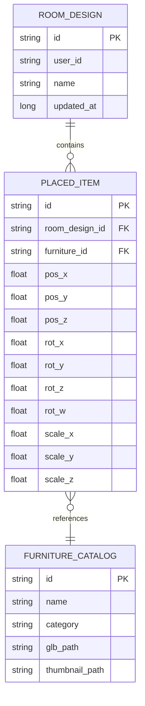
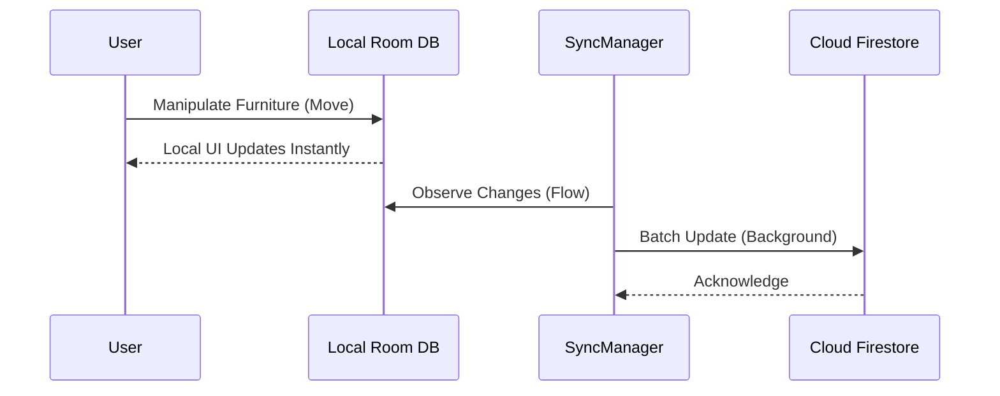

# Database Design and Data Architecture

**Project Title:** Lumiroom: AI-Assisted Mobile AR Furniture Visualization and Interior Planning System  
**Version:** 1.0  
**Date:** 2026-06-10  

---

## 1. Overview
The database architecture uses a hybrid approach:
- **Local Storage (Primary)**: SQLite via Android Room Database. Ensures rapid AR rendering and 100% offline capability.
- **Remote Storage (Secondary)**: Firebase Cloud Firestore. Syncs layouts across devices and provides collaborative features.

---

## 2. Entity Relationship Diagram (ERD)

---

## 3. Schema Definitions

### 3.1 `furniture` Table
| Column | Type | Constraints | Description |
|--------|------|-------------|-------------|
| `id` | TEXT | PRIMARY KEY | UUID for the furniture model |
| `name` | TEXT | NOT NULL | Human-readable name |
| `category` | TEXT | NOT NULL | E.g., Sofa, Table |
| `glb_path` | TEXT | NOT NULL | Local or remote URI to the 3D model |

### 3.2 `room_designs` Table
| Column | Type | Constraints | Description |
|--------|------|-------------|-------------|
| `id` | TEXT | PRIMARY KEY | UUID for the room layout |
| `name` | TEXT | NOT NULL | Custom user name for the room |

### 3.3 `placed_items` Table
| Column | Type | Constraints | Description |
|--------|------|-------------|-------------|
| `id` | TEXT | PRIMARY KEY | UUID for the specific instance placed in AR |
| `room_design_id` | TEXT | FOREIGN KEY | Associates item to a room |
| `furniture_id` | TEXT | FOREIGN KEY | Resolves to the 3D model |
| `pos_x`, `pos_y`, `pos_z` | REAL | NOT NULL | AR world-space translation |
| `rot_x`, `rot_y`, `rot_z`, `rot_w` | REAL | NOT NULL | AR world-space rotation (Quaternion) |
| `scale_x`, `scale_y`, `scale_z` | REAL | NOT NULL | AR world-space scale |

---

## 4. Sync Strategy

- **Conflict Resolution**: Last-Write-Wins based on `updated_at` timestamp.
- **Offline Batching**: Network requests are queued using Android `WorkManager` if the device is offline.
