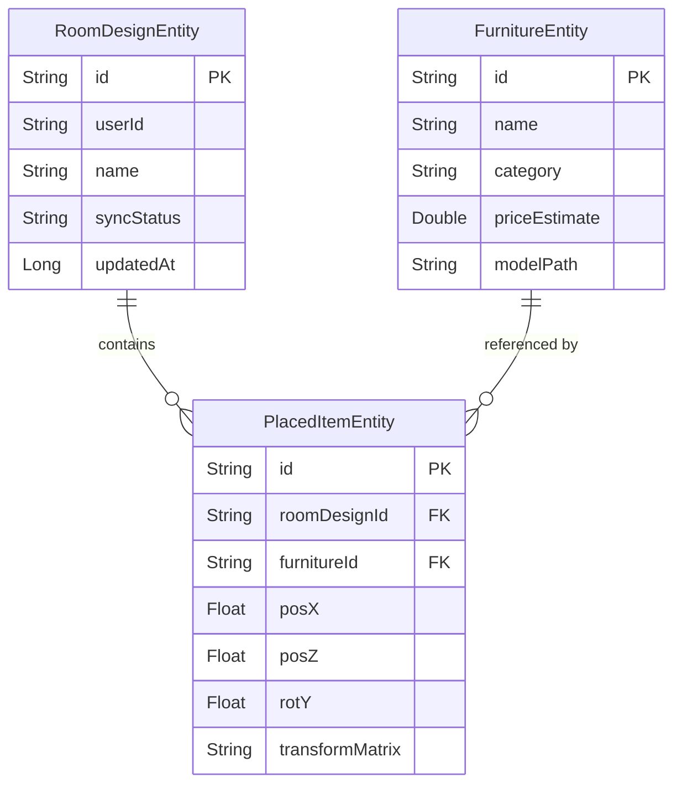

# Database Design Document

## 1. Local Database (Room SQLite)

Lumiroom utilizes an offline-first architecture. The local Room database serves as the single source of truth for the UI.

### 1.1 Entity Relationship Diagram

## 2. Remote Database (Firebase Firestore)

Firestore is used purely as a backup and cross-device synchronization mechanism.

### 2.1 Collection Structure
- `users/{userId}`
  - `profile` (Document)
  - `rooms/{roomId}` (Document)
    - Contains room metadata and an embedded array or subcollection of `placedItems`.

### 2.2 Synchronization Strategy
- **Upload:** When a user modifies a room locally, its `syncStatus` is set to `queued`. The `SyncEngine` (via WorkManager) picks up the change, uploads it to Firestore, and updates the status to `synced`.
- **Download:** On app launch or manual refresh, the `SyncEngine` pulls newer documents from Firestore and overwrites local records, notifying the UI automatically via Room Flow triggers.
