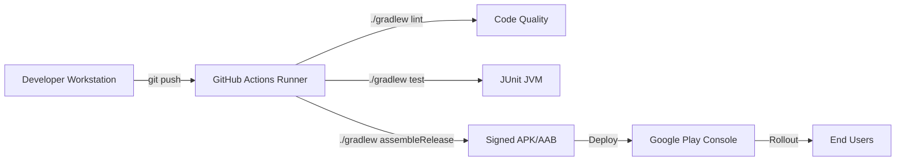

# Deployment Diagrams

**Project:** Lumiroom: AI-Assisted Mobile AR Furniture Visualization and Interior Planning System  
**Version:** 1.0  
**Date:** 2026-06-10  

[⬅ Back to README](../README.md) | [Next: Security Architecture](SecurityArchitecture.md)

---

## 1. Physical Deployment Architecture

Maps the physical hardware and software execution environments.

```mermaid
deploymentDiagram
    node "User Mobile Device" <<Android Smartphone>> {
        node "Android OS" {
            component "Lumiroom APK" {
                component "Compose UI"
                component "SceneView / ARCore"
                component "Room DB"
            }
        }
        device "Microphone"
        device "ToF / LiDAR Camera"
    }

    node "Google Cloud Platform" <<PaaS>> {
        node "Firebase" {
            component "Firestore"
            component "Cloud Storage"
            component "Firebase Auth"
        }
        node "Vertex AI Platform" {
            component "Gemini/Vertex Models"
        }
    }
    
    "User Mobile Device" -- "HTTPS / wss" --> "Google Cloud Platform"
```

## 2. CI/CD Deployment Pipeline

Maps the Github Actions runner nodes for continuous deployment.


