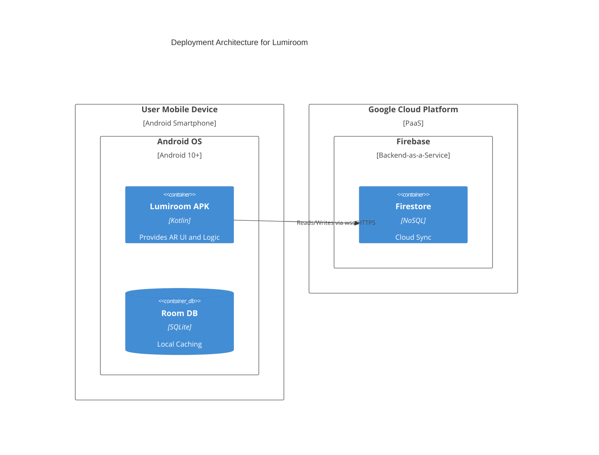
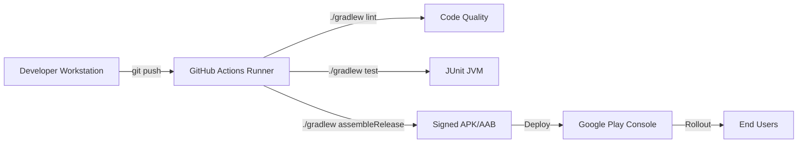

# Deployment Diagrams

**Project:** Lumiroom: AI-Assisted Mobile AR Furniture Visualization and Interior Planning System  
**Version:** 1.0  
**Date:** 2026-06-10  

[⬅ Back to README](../README.md) | [Next: Security Architecture](SecurityArchitecture.md)

---

## 1. Physical Deployment Architecture

Maps the physical hardware and software execution environments.

## 2. CI/CD Deployment Pipeline

Maps the Github Actions runner nodes for continuous deployment.

