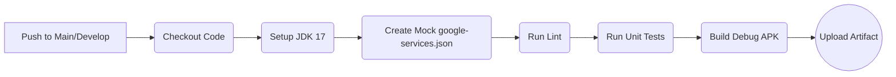

<p align="center">
  
</p>

# Deployment and Build Guide

> [!NOTE]
> **Asset Integration & Pricing Update (v10):**
> Lumiroom has been updated to use a dynamic Model Discovery Engine. Hardcoded `furniture_seed.json` lists have been eliminated. Assets are automatically indexed from the `/assets/models` directory. All prices have been dynamically recalculated to reflect the realistic Indian Market pricing (₹).


**Project:** Lumiroom: AI-Assisted Mobile AR Furniture Visualization and Interior Planning System  
**Version:** 1.0  
**Date:** 2026-06-10  

[⬅ Back to README](../README.md) | [Next: Contributing Guide](ContributingGuide.md)

---

## 1. Development Environment Setup

### 1.1 Requirements

- **JDK**: Java Development Kit 17 (Temurin recommended).
- **IDE**: Android Studio Koala (or latest stable).
- **SDK**: Android SDK API 34 (Minimum API 29).
- **Gradle**: Gradle 8.2+.

### 1.2 Firebase Setup

1. Create a Firebase Project at [Firebase Console](https://console.firebase.google.com/).
2. Enable **Firestore**, **Storage**, and **Authentication**.
3. Register the Android app with package name `com.lumiroom.app`.
4. Download `google-services.json` and place it in the `/app` directory. *(Note: Do not commit this file to version control. Use `google-services.json.example` as a template).*

---

## 2. Build Configurations

### 2.1 Debug Builds

Debug builds (`assembleDebug`) configure a placeholder signing key automatically. They enable detailed logging and AR debugging metrics.

```bash
./gradlew assembleDebug
```

### 2.2 Release Builds and Signing Configuration

Release builds require a `keystore`.

1. Generate a keystore:

```bash
keytool -genkey -v -keystore lumiroom-release.keystore -alias lumiroom -keyalg RSA -keysize 2048 -validity 10000
```

1. Configure `local.properties`:

```properties
RELEASE_STORE_FILE=lumiroom-release.keystore
RELEASE_STORE_PASSWORD=your_password
RELEASE_KEY_ALIAS=lumiroom
RELEASE_KEY_PASSWORD=your_password
```

1. Build the App Bundle for the Play Store:

```bash
./gradlew bundleRelease
```

---

## 3. Continuous Integration and Continuous Deployment (CI/CD)

Lumiroom utilizes **GitHub Actions** for CI/CD automation.

### 3.1 CI Pipeline (`.github/workflows/ci.yml`)



- **Linting**: Android Lint runs on every PR.
- **Testing**: JUnit tests are executed.

---

## 4. Versioning Strategy

Lumiroom follows **Semantic Versioning** (`MAJOR.MINOR.PATCH`).

- `versionCode` is an integer incremented strictly per release.
- `versionName` tracks semantic releases (e.g., `1.2.4`).

---

## 5. Play Store Publishing & Rollback

- Upload the signed `.aab` file to the Google Play Console.
- Rollouts should begin at 10% adoption to monitor crash analytics via Firebase Crashlytics.
- **Rollback Strategy**: In the event of a catastrophic production crash, halt the rollout in the Play Console. Upload the previous `.aab` with an incremented `versionCode`.
