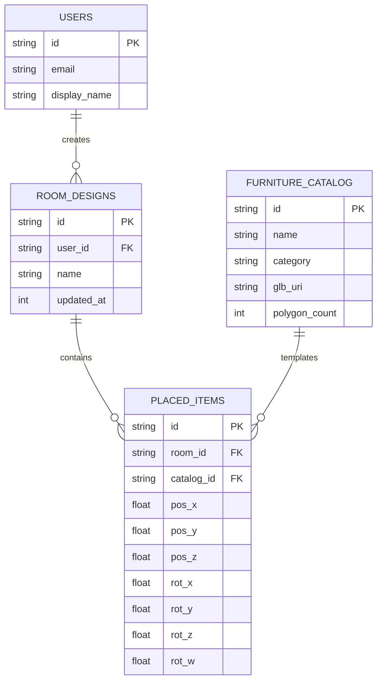

# ER Diagrams

**Project:** Lumiroom: AI-Assisted Mobile AR Furniture Visualization and Interior Planning System  
**Version:** 1.0  
**Date:** 2026-06-10  

[⬅ Back to README](../README.md) | [Next: Data Flow Diagrams](DataFlowDiagrams.md)

---

## 1. Local Database Schema (Room SQLite)

## 2. Constraints & Indexes
- Foreign key constraints heavily cascade on delete (e.g., deleting a `ROOM_DESIGN` cascades deletion to all associated `PLACED_ITEMS`).
- Composite index on `(room_id, catalog_id)` optimizes scene loading performance.
