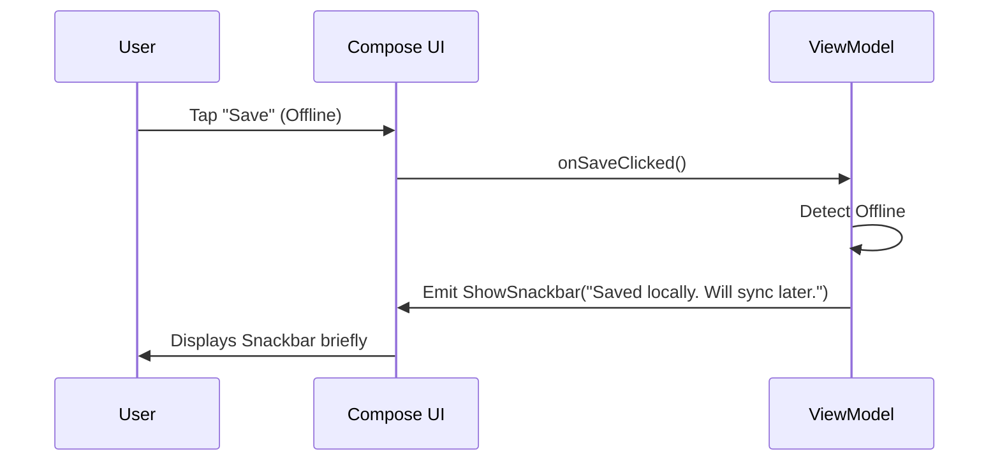

# Event Flow

**Project:** Lumiroom: AI-Assisted Mobile AR Furniture Visualization and Interior Planning System  

[⬅ Back to Data Flow Diagrams](DataFlowDiagrams.md)

Lumiroom differentiates between **State** (which is continuous and sticky, like the list of placed furniture) and **Events** (which are one-off triggers, like showing a SnackBar or navigating).

## Event Handling Architecture

Lumiroom uses Kotlin `Channel`s or `SharedFlow` for event busing from the ViewModel to the UI.

1. **Emission**: ViewModels have a private `Channel<UiEvent>` and expose a public `receiveAsFlow()`.
2. **Observation**: Composables use `LaunchedEffect` to collect these events safely with `Lifecycle.State.STARTED`.

## Common Event Types

- `ShowSnackbar(message: String)`
- `Navigate(route: String)`
- `ShowErrorDialog(exception: Throwable)`
- `PlayHapticFeedback(type: HapticType)`

## Example Flow

