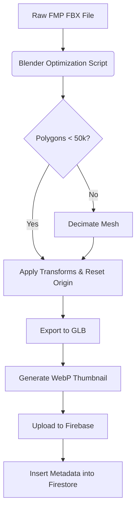

# Furniture Mega Pack (FMP) Integration Guide

> [!NOTE]
> **Asset Integration & Pricing Update (v10):**
> Lumiroom has been updated to use a dynamic Model Discovery Engine. Hardcoded `furniture_seed.json` lists have been eliminated. Assets are automatically indexed from the `/assets/models` directory. All prices have been dynamically recalculated to reflect the realistic Indian Market pricing (₹).
>
> **AR Synchronization & AppCheck Update (v1.1.1):**
> Addressed Firebase AppCheck initialization failures by applying `DebugAppCheckProviderFactory` on debug builds. AR placement stability is improved by correctly persisting tracking anchors and synchronizing Y/Z axes with the 2D planner.

**Project:** Lumiroom: AI-Assisted Mobile AR Furniture Visualization and Interior Planning System  
**Version:** 1.0  
**Date:** 2026-06-10  

[⬅ Back to README](../README.md) | [Next: Asset Pipeline](AssetPipeline.md)

---

## 1. Introduction

The Furniture Mega Pack (FMP) is an external repository containing hundreds of high-quality 3D assets. This document defines the standard operating procedure (SOP) for processing raw FMP models and integrating them into Lumiroom's AR engine.

## 2. Integration Workflow

## 3. Pivot and Origin Correction

For AR placement to function correctly, the 3D model's origin (0,0,0) must represent the **bottom-center** of the physical object.

1. Open the model in Blender.
2. Select all meshes.
3. Move the geometry so that the lowest bounding point touches the Z=0 plane.
4. Center the geometry on the X and Y axes.
5. Apply all transforms (`Ctrl+A` -> `All Transforms`).

## 4. Metadata Creation and Naming Conventions

Each integrated model must have a corresponding Firestore entry.

- **`id`**: Autogenerated UUID.
- **`name`**: Extracted from FMP (e.g., "Modern Velvet Sofa").
- **`category`**: Seating, Tables, Decor, Lighting, Storage, or Beds.
- **`glb_path`**: Storage bucket URI (`gs://lumiroom.firebasestorage.app/models/...`).

## 5. Automation Tools

To speed up integration, use the included Python automation script (`scripts/fmp_batch_processor.py`) which utilizes the `bpy` (Blender Python) library to automate the decimation, pivot correction, and GLB export process.
