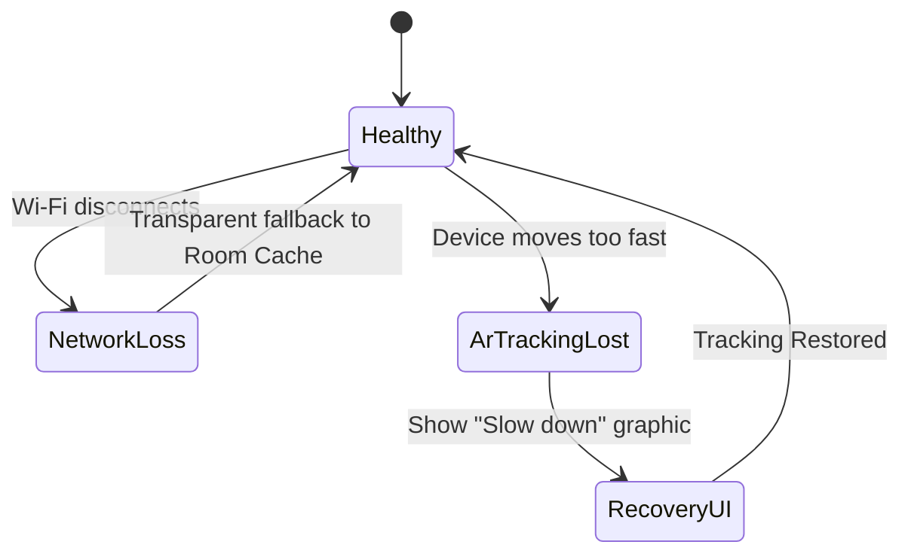

# Risk Assessment and Mitigation

**Project:** Lumiroom: AI-Assisted Mobile AR Furniture Visualization and Interior Planning System  
**Version:** 1.0  
**Date:** 2026-06-10  

[⬅ Back to README](../README.md) | [Next: Performance Analysis](PerformanceAnalysis.md)

---

## 1. Risk Matrix

| Risk ID | Description | Probability | Impact | Risk Level | Mitigation Strategy |
|---------|-------------|-------------|--------|------------|---------------------|
| R-01 | OutOfMemory (OOM) due to massive 3D GLB loading. | High | Critical | High | Implement Draco compression. Cap scene at 15 items. explicitly call `System.gc()` on `onTrimMemory`. |
| R-02 | ARCore unsupported on target device. | Medium | High | High | Detect support on startup. Provide a 2D floor-planner fallback UI. |
| R-03 | Vertex AI rate limits exceeded. | Low | Medium | Low | Cache health scores locally. Implement exponential backoff for retries. |
| R-04 | User offline during critical save. | High | Low | Low | Fully offline-first Room DB architecture. Sync queue handles recovery seamlessly. |
| R-05 | Speech transcription failure in loud environments. | Medium | Medium | Medium | Provide touch-based fallback controls for all Voice commands. |

## 2. Failure Handling States

