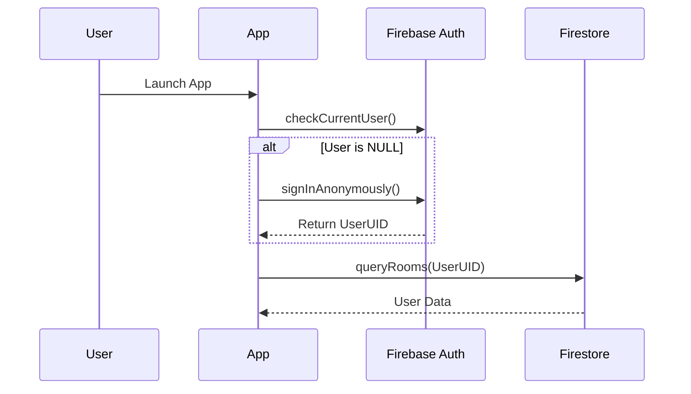

# Security Architecture

**Project:** Lumiroom: AI-Assisted Mobile AR Furniture Visualization and Interior Planning System  
**Version:** 2.0  

[⬅ Back to README](../README.md) | [Next: API Reference](APIReference.md)

---

## 1. Authentication Flow Diagram

All users must be authenticated anonymously or via Google Sign-In to access cloud features.



## 2. Threat Model & Trust Boundaries

| Threat | Vulnerability | Mitigation Strategy |
|--------|--------------|---------------------|
| Man-in-the-Middle (MitM) | Intercepting Firestore traffic | Handled natively by Firebase via TLS 1.3 pinning. |
| Insecure Local Storage | Reading cached Room DB | `RoomDesignDao` and `RoomDatabase` files are stored strictly within Android's sandboxed `data/data/com.lumiroom.app` directory, inaccessible without root. |
| Malicious Serialization | Corrupt JSON parsing | Serialization of `RoomModel` and Cloud payloads is strictly typed using `kotlinx.serialization` to prevent injection via JSON. |
| Unauthorized Cloud Reads | Malicious API calls | Firestore Security Rules strictly enforce `request.auth.uid == resource.data.user_id`. |

## 3. Runtime Permissions and Camera Access

Lumiroom interacts heavily with physical sensors. We adhere strictly to Android's principle of least privilege.

### ARCore Camera Access
- Controlled by `ArCaptureUtils` and `LumiroomArSessionManager`.
- The camera feed is **never** sent to the cloud.
- The `CAMERA` permission is requested *only* when the user explicitly taps the "AR Mode" button.
- If denied, the app gracefully falls back entirely to the 2D planner without crashing.

### Storage Access
- The app uses Scoped Storage (MediaStore) when the user explicitly requests to export a snapshot image of their room to their gallery. We do not require `READ_EXTERNAL_STORAGE` for normal operation.

## 4. Firestore Security Rules

```javascript
rules_version = '2';
service cloud.firestore {
  match /databases/{database}/documents {
    match /users/{userId}/rooms/{roomId} {
      allow read, write: if request.auth != null && request.auth.uid == userId;
      
      match /items/{itemId} {
        allow read, write: if request.auth != null && request.auth.uid == userId;
      }
      match /walls/{wallId} {
        allow read, write: if request.auth != null && request.auth.uid == userId;
      }
    }
    match /catalog/{itemId} {
      allow read: if true; // Public catalog
      allow write: if false; // Only admins can edit catalog
    }
  }
}
```
