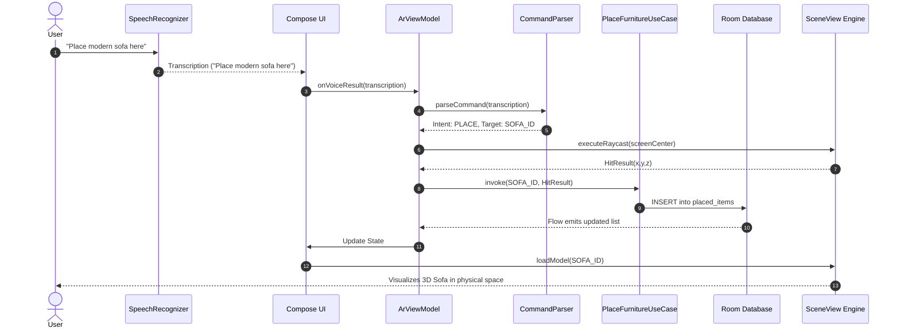
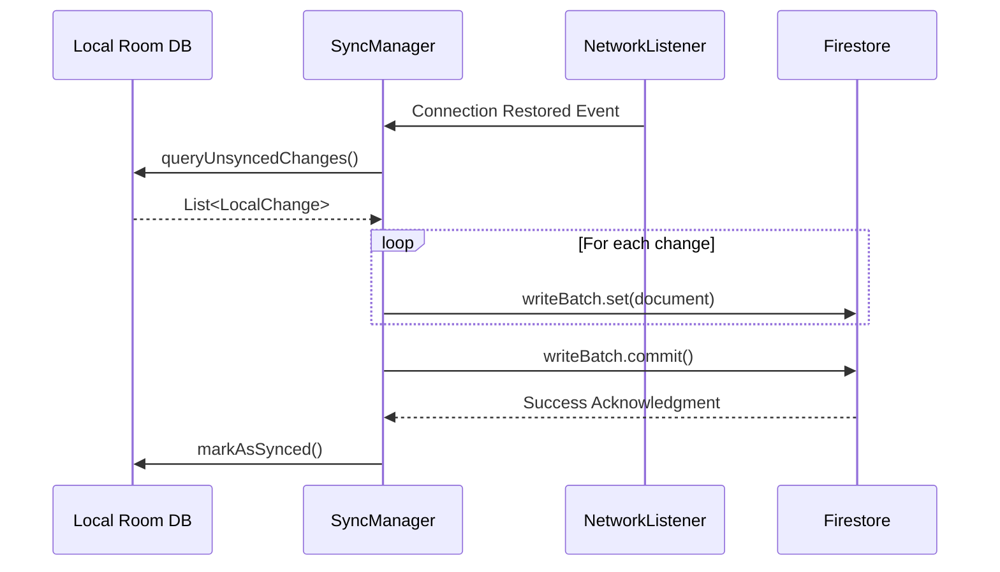

# Sequence Diagrams

**Project:** Lumiroom: AI-Assisted Mobile AR Furniture Visualization and Interior Planning System  
**Version:** 1.0  
**Date:** 2026-06-10  

[⬅ Back to README](../README.md) | [Next: Class Diagrams](ClassDiagrams.md)

---

## 1. Voice Command Placement Sequence

This sequence details the complete flow from a user speaking a command to a 3D object rendering in AR space.

---

## 2. Cloud Synchronization Sequence

Details the background sync mechanism when network connectivity is restored.

