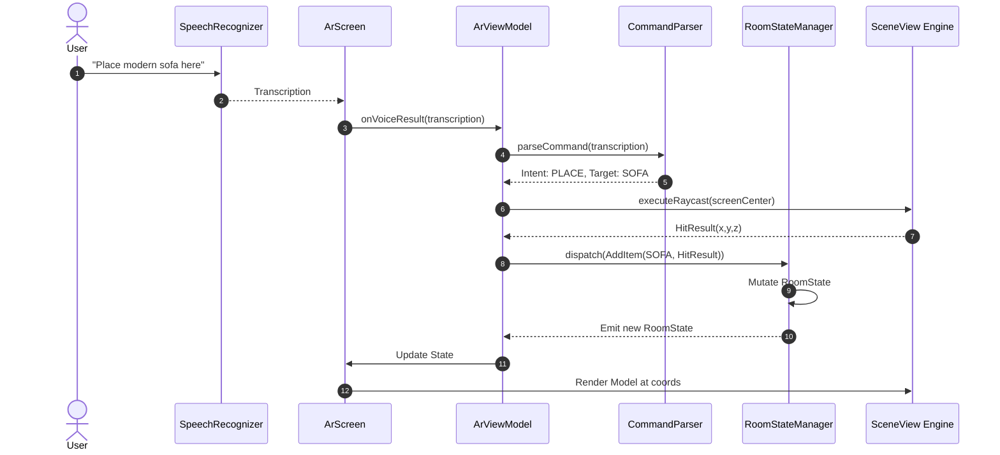
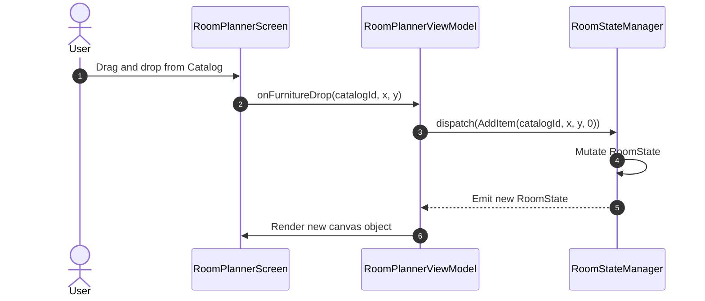
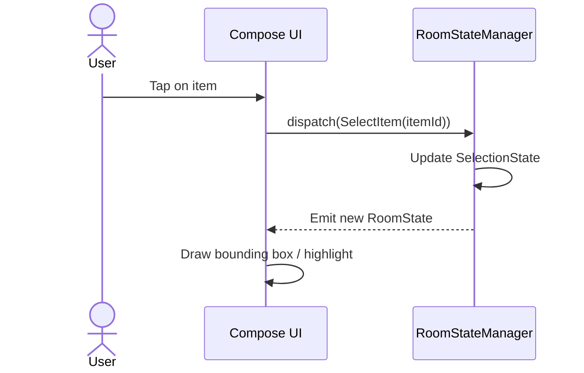
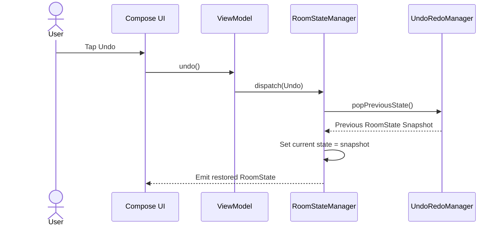
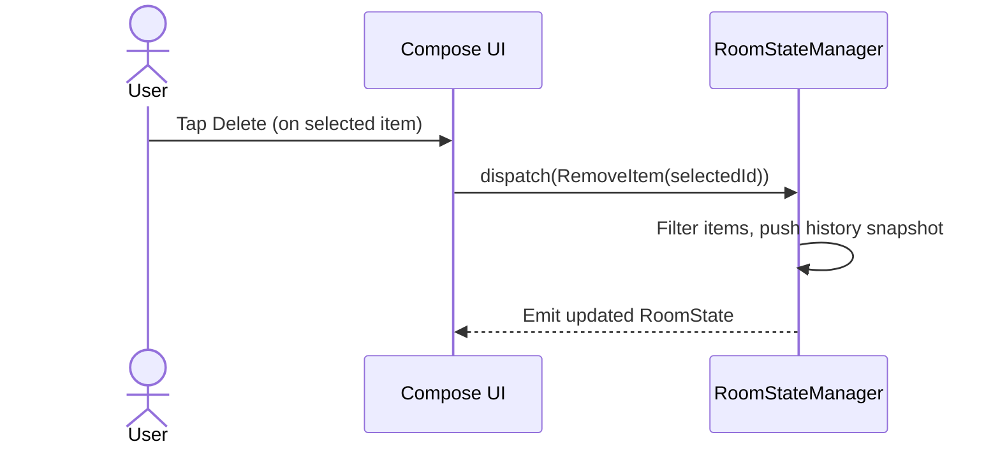
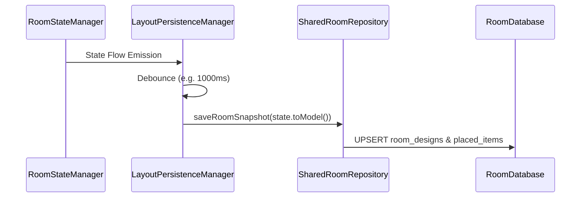
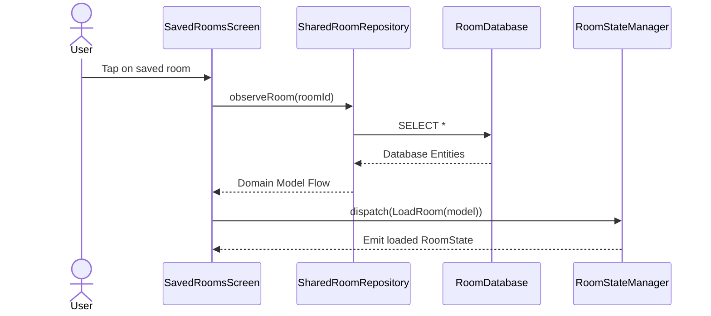
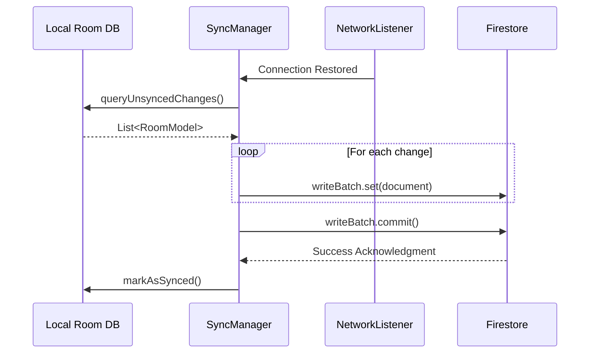

# Sequence Diagrams

**Project:** Lumiroom: AI-Assisted Mobile AR Furniture Visualization and Interior Planning System  
**Version:** 2.0  

[⬅ Back to C4 Architecture](C4Architecture.md) | [Next: State Machine Diagrams](StateMachineDiagrams.md)

---

## 1. Voice Command AR Placement

---

## 2. 2D Planner Placement

---

## 3. Selection Flow

---

## 4. Undo Operation

---

## 5. Delete Furniture

---

## 6. Save Project & Autosave

---

## 7. Load Project

---

## 8. Cloud Synchronization

