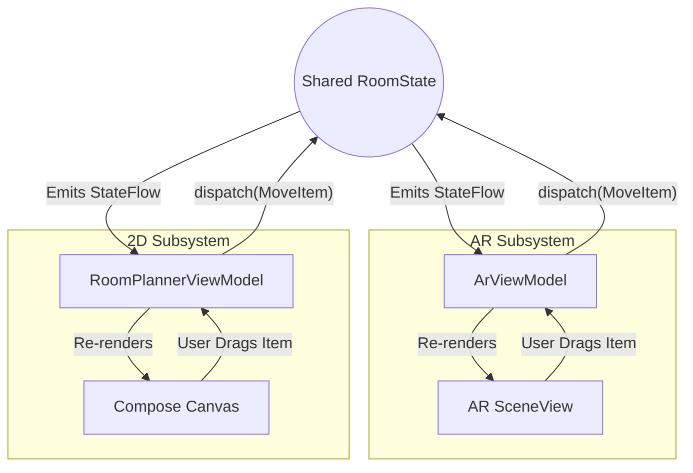

# Shared State Flow

**Project:** Lumiroom: AI-Assisted Mobile AR Furniture Visualization and Interior Planning System  

[⬅ Back to Event Flow](EventFlow.md)

Lumiroom is unique in that it offers two radically different paradigms for interacting with the same data: **AR Mode** (Physical 3D) and **2D Planner** (Logical 2D).

To ensure that actions taken in one mode instantly reflect in the other, both modes observe a single, shared `StateFlow` exposed by the `RoomStateManager` (living in the `core:domain` module).

## The Core Loop



## State Object Structure

The `RoomState` is an immutable data class. Any change creates a new copy of the state using `.copy()`, triggering Compose's powerful reallocation mechanisms automatically.

```kotlin
data class RoomState(
    val furniture: List<PlacedItem> = emptyList(),
    val walls: List<WallEntity> = emptyList(),
    val selectionState: SelectionState = SelectionState.None,
    val historyPointer: Int = 0
)
```

By decoupling the *rendering* (AR vs 2D) from the *state management*, Lumiroom avoids all edge cases related to synchronizing two different screens.
