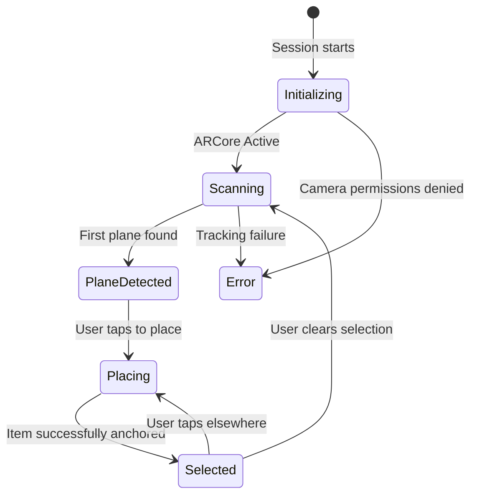
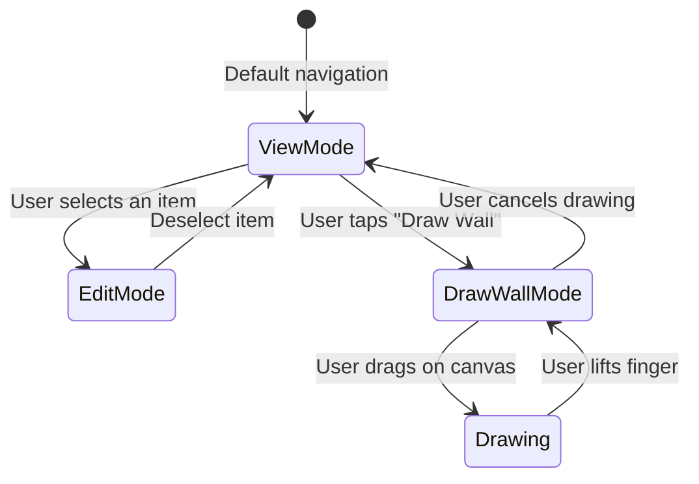
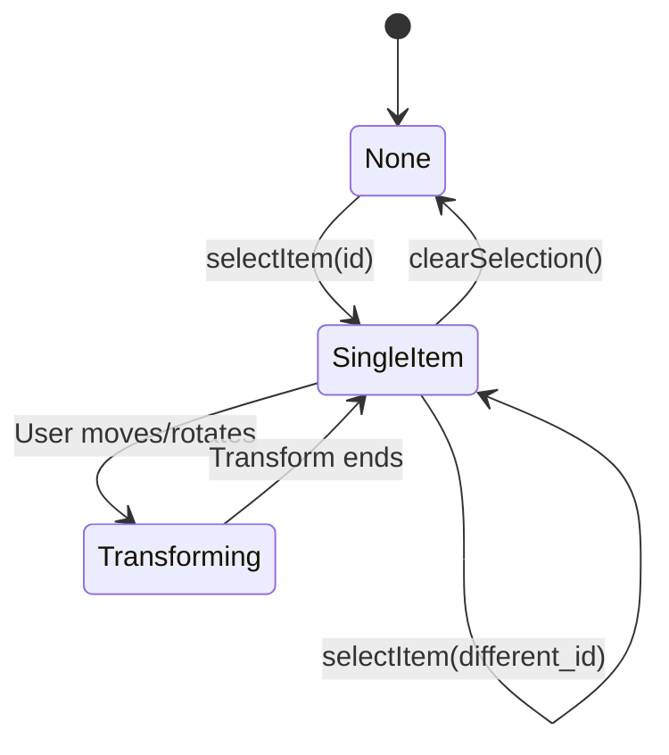
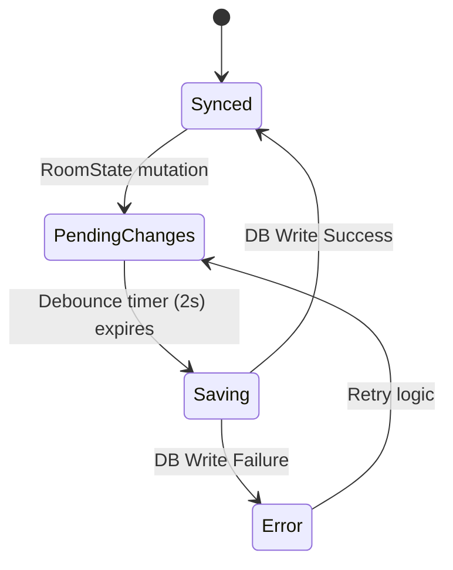
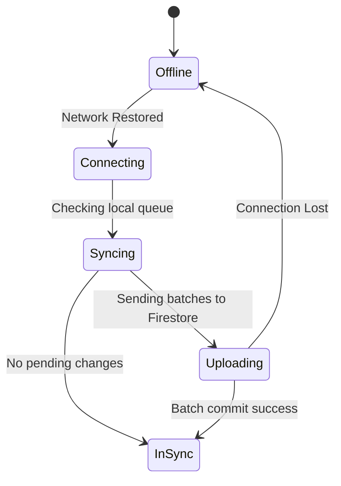

# State Machine Diagrams

> [!NOTE]
> **Asset Integration & Pricing Update (v10):**
> Lumiroom has been updated to use a dynamic Model Discovery Engine. Hardcoded `furniture_seed.json` lists have been eliminated. Assets are automatically indexed from the `/assets/models` directory. All prices have been dynamically recalculated to reflect the realistic Indian Market pricing (₹).

**Project:** Lumiroom: AI-Assisted Mobile AR Furniture Visualization and Interior Planning System  
**Version:** 2.0  

[⬅ Back to Sequence Diagrams](SequenceDiagrams.md) | [Next: Activity Diagrams](ActivityDiagrams.md)

---

## 1. AR UI States (`ArUiState`)

The states that the AR Screen composable reacts to.

---

## 2. 2D Planner UI States (`RoomPlannerUiState`)

The top-down canvas planner states.

---

## 3. Selection States

The shared selection lifecycle inside the `RoomStateManager`.

---

## 4. Save States (LayoutPersistenceManager)

Debounced saving states to local Room DB.

---

## 5. Synchronization States (SyncManager)

Background state of syncing to Firebase.

