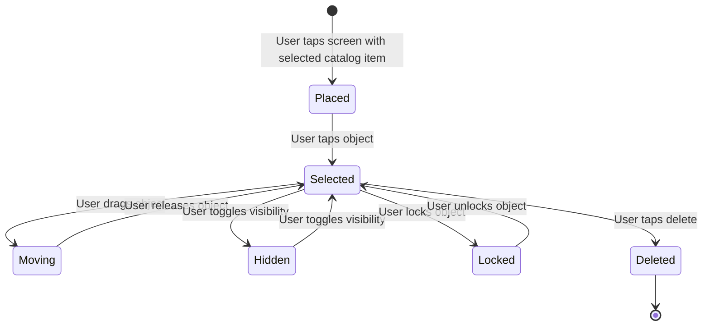
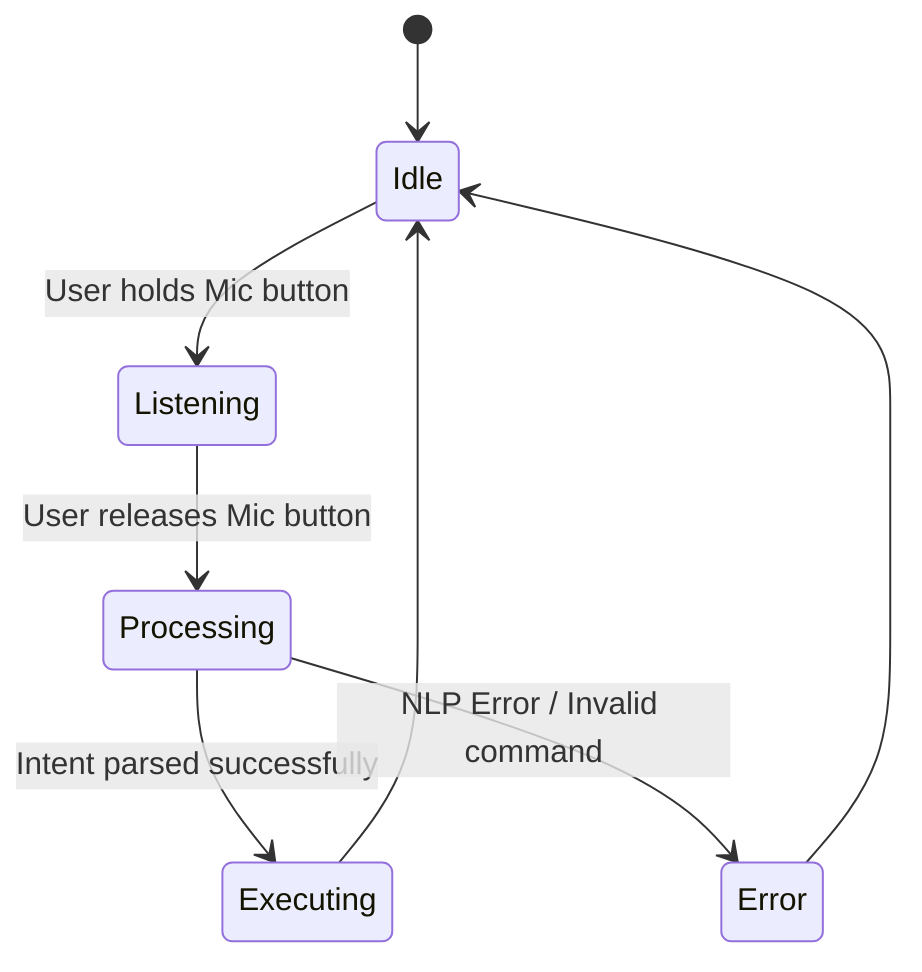

# State Machine Diagrams

**Project:** Lumiroom: AI-Assisted Mobile AR Furniture Visualization and Interior Planning System  
**Version:** 1.0  
**Date:** 2026-06-10  

[⬅ Back to README](../README.md) | [Next: Activity Diagrams](ActivityDiagrams.md)

---

## 1. AR Entity Lifecycle

Describes the state of a 3D furniture model inside the AR Scene.

## 2. Voice Command State Machine

Handles the state progression of the SpeechRecognizer.

