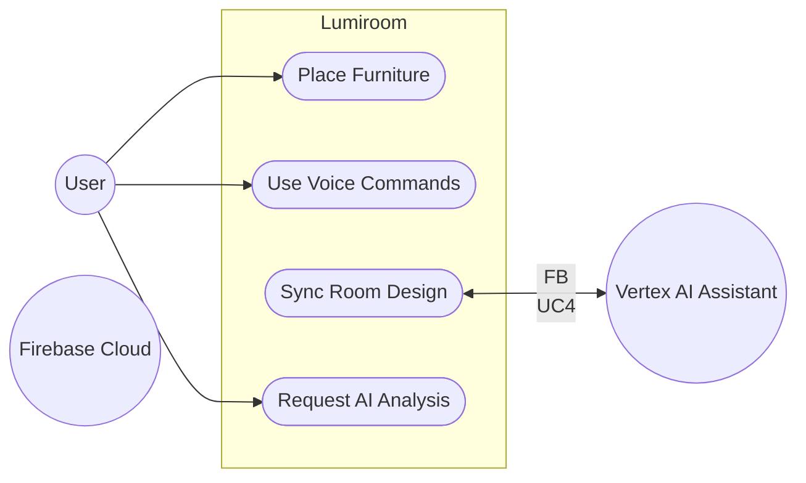

# Use Cases

**Project:** Lumiroom: AI-Assisted Mobile AR Furniture Visualization and Interior Planning System  
**Version:** 1.0  
**Date:** 2026-06-10  

[⬅ Back to README](../README.md) | [Next: UML Diagrams](UMLDiagrams.md)

---

## 1. Primary Actors

1. **User (Consumer)**: Uses the app to design their room.
2. **AI Assistant (Lumi)**: Processes room health requests and suggests layouts.
3. **Firebase Cloud**: Syncs configurations and serves asset binaries.

---

## 2. Global Use Case Diagram

---

## 3. Narrative Use Cases

### UC-01: Voice Furniture Placement
- **Trigger**: User speaks a placement command.
- **Flow**:
  1. User activates microphone.
  2. User states, "Place a modern sofa here."
  3. SpeechRecognizer API transcribes the intent.
  4. CommandParser resolves "modern sofa" to an FMP model ID.
  5. PlacementManager executes a raycast and spawns the object.
- **Exceptions**: Catalog item not found (shows fallback UI).

### UC-02: Offline Sync Queuing
- **Trigger**: User makes an edit while offline.
- **Flow**:
  1. Device loses Wi-Fi.
  2. User moves a chair.
  3. Change saved instantly to Local Room DB.
  4. SyncManager queues a Firestore transaction.
  5. Device regains Wi-Fi.
  6. Transaction flushes to Firebase.
