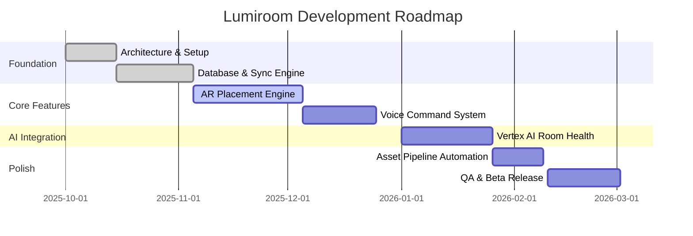

# Project Implementation Plan and Roadmap

**Project:** Lumiroom: AI-Assisted Mobile AR Furniture Visualization and Interior Planning System  
**Version:** 1.0  
**Date:** 2026-06-10  

[⬅ Back to README](../README.md) | [Next: Testing Report](TestingReport.md)

---

## 1. Project Management Overview
The development of Lumiroom follows an Agile methodology structured around 2-week sprints.

### 1.1 Gantt Chart Roadmap

## 2. Work Breakdown Structure (WBS)

1. **Infrastructure**
   - 1.1 CI/CD Pipeline
   - 1.2 Hilt Dependency Graph
   - 1.3 Firebase Setup
2. **Data Layer**
   - 2.1 Room Schema Design
   - 2.2 Firestore Sync Manager
3. **Domain Layer**
   - 3.1 PlaceFurnitureUseCase
   - 3.2 VoiceCommandParser
4. **UI Layer**
   - 4.1 Jetpack Compose Navigation
   - 4.2 AR SceneView Integration

## 3. Risk Analysis
See [Risk Assessment](RiskAssessment.md) for full mitigation matrices.

## 4. Release Plan
- **Alpha (v0.1)**: Core AR placement with 10 built-in models. Local database only.
- **Beta (v0.5)**: Cloud sync, 500+ models from FMP, and Voice Commands.
- **V1.0 (Production)**: Vertex AI recommendations, full UI polish, and public Play Store release.
