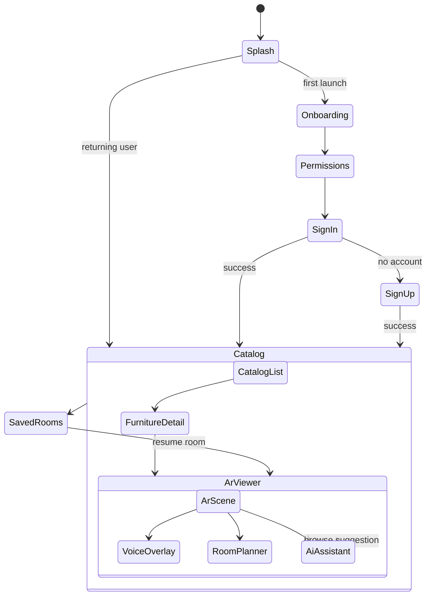
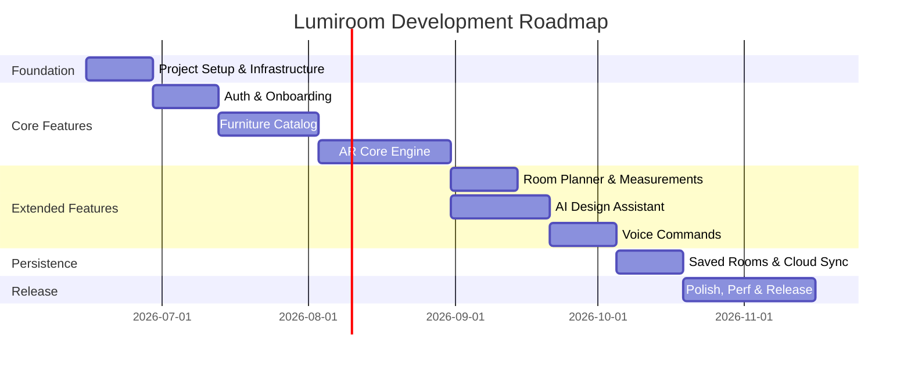
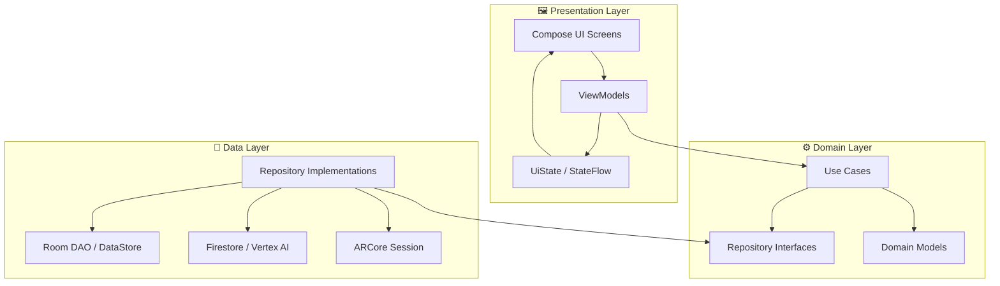
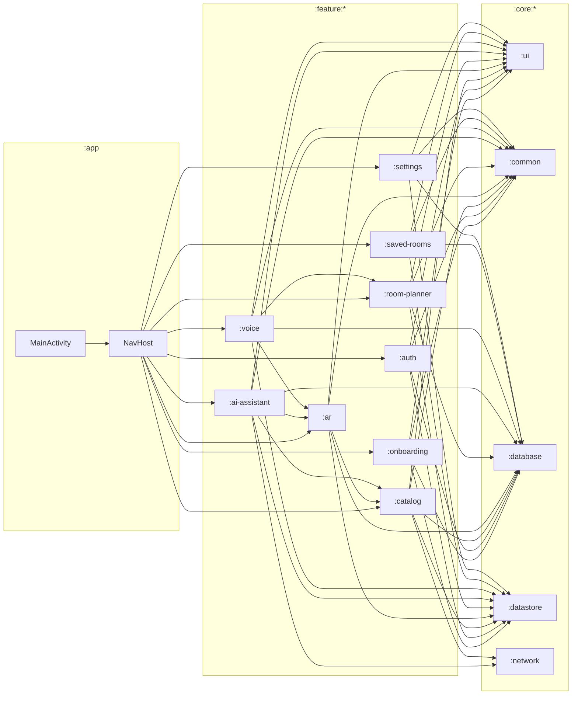
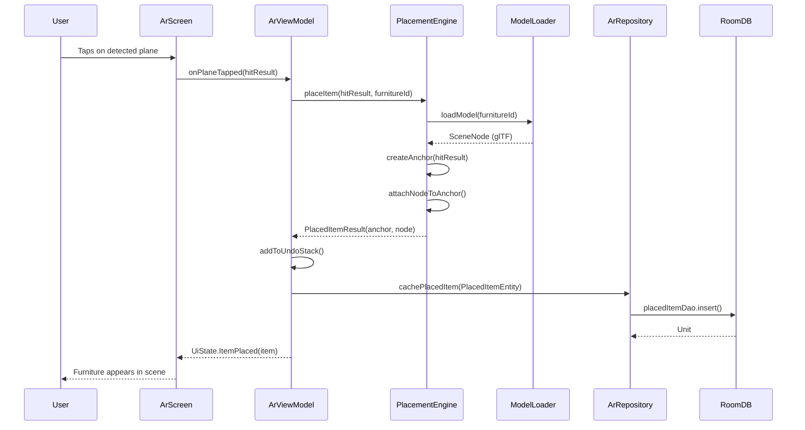
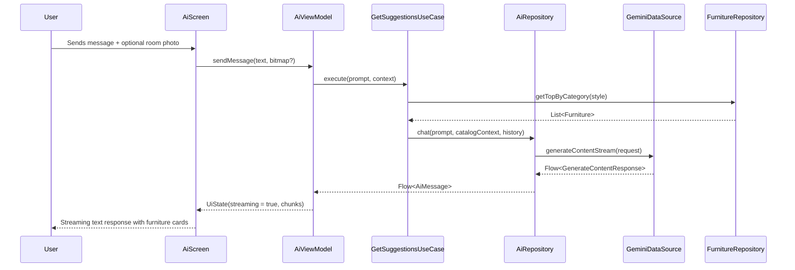
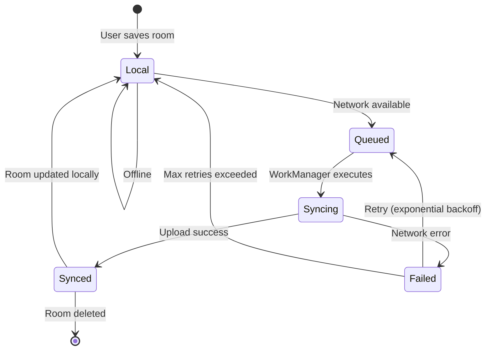
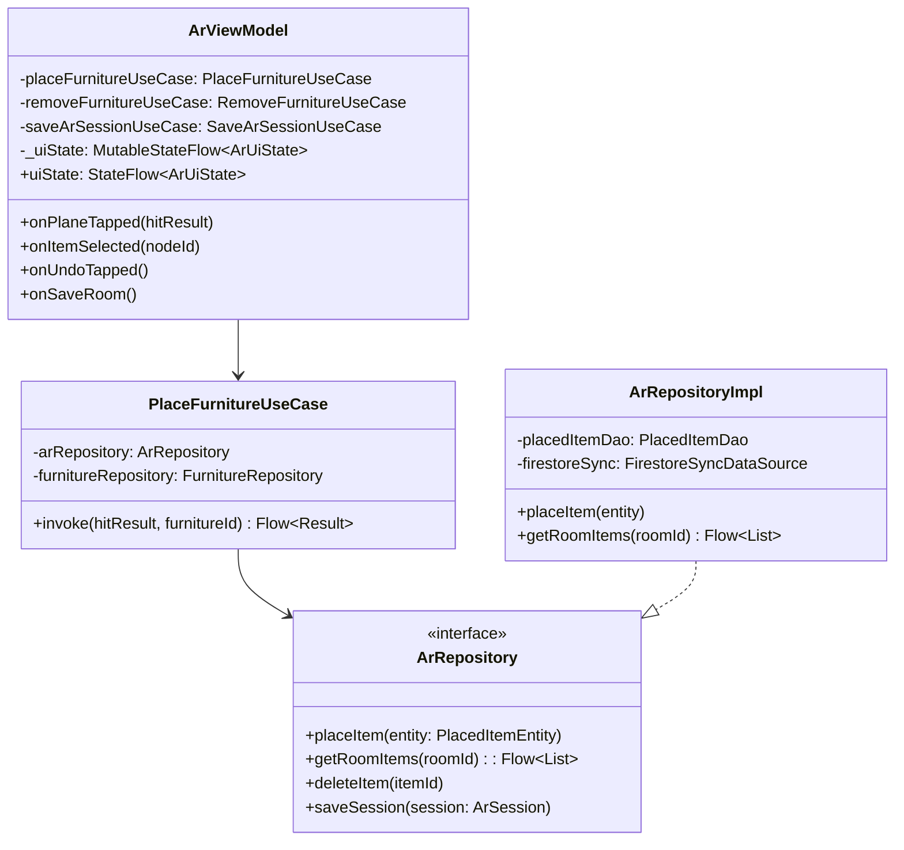
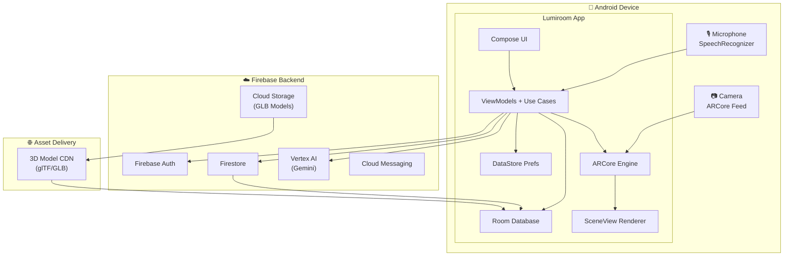

# Lumiroom — AI-Assisted Mobile AR Furniture Visualization & Interior Planning System
## Complete Technical Architecture & Project Planning Document

---

> [!IMPORTANT]
> This document is the single source of truth for all architectural decisions before implementation begins. Review all open questions at the end before approving.

---

## Table of Contents

1. [Executive Summary](#1-executive-summary)
2. [System Architecture Overview](#2-system-architecture-overview)
3. [Module Definitions](#3-module-definitions)
4. [Folder Structure](#4-folder-structure)
5. [Database Schema](#5-database-schema)
6. [Navigation Flow](#6-navigation-flow)
7. [Feature Specifications](#7-feature-specifications)
8. [Implementation Milestones](#8-implementation-milestones)
9. [Development Roadmap](#9-development-roadmap)
10. [Technical Risk Analysis](#10-technical-risk-analysis)
11. [UML-Style Architecture Diagrams](#11-uml-style-architecture-diagrams)
12. [Open Questions](#12-open-questions)

---

## 1. Executive Summary

**Lumiroom** is an AI-powered Android application that enables users to visualize furniture and interior design elements in their physical space using Augmented Reality. The app combines ARCore-based spatial awareness, a curated furniture catalog, voice command control, AI-generated design suggestions, and persistent room-saving capabilities into a single cohesive experience.

### Core Value Propositions
| Capability | Technology |
|---|---|
| Real-time AR furniture placement | ARCore + SceneView |
| AI-driven design recommendations | Firebase Vertex AI / Gemini API |
| Voice-controlled room editing | Android SpeechRecognizer API |
| Cross-session persistence | Room Database + Firebase Firestore |
| Authentic 3D model rendering | SceneView (glTF/GLB models) |
| User authentication & cloud sync | Firebase Auth + Firestore |

---

## 2. System Architecture Overview

Lumiroom follows a **Clean Architecture** pattern organized into three primary layers, each further subdivided into feature-based modules. This ensures testability, scalability, and clear separation of concerns.

### Architectural Layers

```
┌─────────────────────────────────────────────────────────────────┐
│                      PRESENTATION LAYER                         │
│  Jetpack Compose UI  │  ViewModels  │  UI State (StateFlow)     │
├─────────────────────────────────────────────────────────────────┤
│                        DOMAIN LAYER                             │
│     Use Cases  │  Repository Interfaces  │  Domain Models       │
├─────────────────────────────────────────────────────────────────┤
│                          DATA LAYER                             │
│  Room DB  │  Firebase  │  DataStore  │  Remote API  │  AR Cache │
└─────────────────────────────────────────────────────────────────┘
```

### Architectural Pattern: MVVM + Clean Architecture

- **UI** → Observes `UiState` sealed classes from ViewModel
- **ViewModel** → Executes Use Cases; holds no business logic itself
- **Use Case** → Orchestrates data flow between repositories
- **Repository** → Abstracts data sources (local DB vs. remote)
- **Data Source** → Room DAO, Firestore, DataStore, ARCore session

### Key Architectural Decisions

| Decision | Choice | Rationale |
|---|---|---|
| DI Framework | Hilt | Native Jetpack integration, compile-time safety |
| State Management | StateFlow + UiState sealed class | Lifecycle-aware, composable-friendly |
| Threading | Kotlin Coroutines + Flow | Structured concurrency, no callback hell |
| Navigation | Navigation Compose | Type-safe, backstack-aware, Hilt-integrated |
| AR Rendering | SceneView (Filament) | Modern replacement to Sceneform, Compose-compatible |
| 3D Format | glTF 2.0 / GLB | Industry standard, physically-based rendering |
| Local Persistence | Room Database | Type-safe, coroutines-native, Hilt-injectable |
| Remote Persistence | Firebase Firestore | Real-time sync, offline support |
| Preferences | DataStore (Proto) | Coroutines-native, type-safe preference storage |
| AI Backend | Firebase Vertex AI (Gemini) | On-device + cloud hybrid, Google ecosystem |

---

## 3. Module Definitions

Lumiroom uses a **multi-module Gradle project** to enforce dependency rules and speed up incremental builds.

```
:app                          ← Entry point, DI graph root, navigation host
:core:ui                      ← Shared Compose components, theme, typography
:core:common                  ← Extensions, utilities, constants, base classes
:core:network                 ← Retrofit/OkHttp client, interceptors
:core:database                ← Room database, DAOs, entities
:core:datastore               ← DataStore definitions and accessors
:core:testing                 ← Shared test utilities, fakes, rules
:feature:onboarding           ← Splash, intro carousel, permissions
:feature:auth                 ← Sign in, sign up, profile
:feature:catalog              ← Furniture browse, search, filter
:feature:ar                   ← ARCore session, SceneView, placement engine
:feature:room-planner         ← 2D room editor, floor plan, measurements
:feature:ai-assistant         ← Gemini chat, design suggestions, style quiz
:feature:voice                ← SpeechRecognizer integration, command parser
:feature:saved-rooms          ← Room persistence, sharing, export
:feature:settings             ← User preferences, theme, AR calibration
```

### Module Dependency Rules

```
:app              → all :feature:* modules
:feature:*        → :core:ui, :core:common, :core:database, :core:datastore
:feature:ar       → :feature:catalog (for model metadata)
:feature:ai-assistant → :feature:catalog, :feature:ar
:feature:voice    → :feature:ar, :feature:room-planner
:core:database    → :core:common
:core:network     → :core:common
:core:ui          → :core:common
```

> [!NOTE]
> No `:feature:*` module may depend on another `:feature:*` module except via shared `:core:*` interfaces. Cross-feature communication happens through shared repositories in `:core:database` or via Navigation arguments.

---

## 4. Folder Structure

```
Lumiroom/
├── app/
│   ├── src/main/
│   │   ├── kotlin/com/lumiroom/app/
│   │   │   ├── LumiroomApp.kt                  ← Application class
│   │   │   ├── MainActivity.kt                 ← Single Activity host
│   │   │   └── navigation/
│   │   │       ├── LumiroomNavHost.kt          ← Root NavHost
│   │   │       └── TopLevelDestination.kt      ← Bottom nav destinations
│   │   └── res/
│   │       ├── values/strings.xml
│   │       └── xml/network_security_config.xml
│   └── build.gradle.kts
│
├── core/
│   ├── ui/
│   │   └── src/main/kotlin/com/lumiroom/core/ui/
│   │       ├── theme/
│   │       │   ├── LumiroomTheme.kt
│   │       │   ├── Color.kt
│   │       │   ├── Typography.kt
│   │       │   └── Shape.kt
│   │       ├── components/
│   │       │   ├── LumiroomTopBar.kt
│   │       │   ├── LumiroomBottomBar.kt
│   │       │   ├── FurnitureCard.kt
│   │       │   ├── LoadingOverlay.kt
│   │       │   ├── ErrorDialog.kt
│   │       │   └── PermissionRationale.kt
│   │       └── icons/
│   │           └── LumiroomIcons.kt
│   │
│   ├── common/
│   │   └── src/main/kotlin/com/lumiroom/core/common/
│   │       ├── result/
│   │       │   └── LumiroomResult.kt           ← sealed class Result<T>
│   │       ├── extensions/
│   │       │   ├── FlowExtensions.kt
│   │       │   └── StringExtensions.kt
│   │       ├── dispatchers/
│   │       │   └── LumiroomDispatchers.kt      ← @Dispatcher qualifier
│   │       └── util/
│   │           ├── NetworkMonitor.kt
│   │           └── PermissionHelper.kt
│   │
│   ├── network/
│   │   └── src/main/kotlin/com/lumiroom/core/network/
│   │       ├── di/
│   │       │   └── NetworkModule.kt
│   │       ├── interceptor/
│   │       │   ├── AuthInterceptor.kt
│   │       │   └── LoggingInterceptor.kt
│   │       └── model/
│   │           └── ApiResponse.kt
│   │
│   ├── database/
│   │   └── src/main/kotlin/com/lumiroom/core/database/
│   │       ├── LumiroomDatabase.kt             ← RoomDatabase
│   │       ├── di/
│   │       │   └── DatabaseModule.kt
│   │       ├── dao/
│   │       │   ├── FurnitureDao.kt
│   │       │   ├── RoomDesignDao.kt
│   │       │   ├── PlacedItemDao.kt
│   │       │   ├── UserPreferencesDao.kt
│   │       │   └── AiSessionDao.kt
│   │       ├── entity/
│   │       │   ├── FurnitureEntity.kt
│   │       │   ├── RoomDesignEntity.kt
│   │       │   ├── PlacedItemEntity.kt
│   │       │   ├── UserProfileEntity.kt
│   │       │   └── AiSessionEntity.kt
│   │       ├── relation/
│   │       │   └── RoomDesignWithItems.kt
│   │       └── converter/
│   │           ├── MatrixConverter.kt          ← AR transform matrix ↔ JSON
│   │           └── ColorConverter.kt
│   │
│   ├── datastore/
│   │   └── src/main/kotlin/com/lumiroom/core/datastore/
│   │       ├── di/
│   │       │   └── DataStoreModule.kt
│   │       ├── AppPreferences.kt
│   │       └── AppPreferencesDataSource.kt
│   │
│   └── testing/
│       └── src/main/kotlin/com/lumiroom/core/testing/
│           ├── fake/
│           │   ├── FakeFurnitureRepository.kt
│           │   └── FakeRoomDesignRepository.kt
│           └── rule/
│               └── MainDispatcherRule.kt
│
├── feature/
│   ├── onboarding/
│   │   └── src/main/kotlin/com/lumiroom/feature/onboarding/
│   │       ├── OnboardingScreen.kt
│   │       ├── OnboardingViewModel.kt
│   │       ├── SplashScreen.kt
│   │       └── PermissionScreen.kt
│   │
│   ├── auth/
│   │   └── src/main/kotlin/com/lumiroom/feature/auth/
│   │       ├── data/
│   │       │   ├── AuthRepository.kt
│   │       │   └── FirebaseAuthDataSource.kt
│   │       ├── domain/
│   │       │   ├── SignInUseCase.kt
│   │       │   ├── SignUpUseCase.kt
│   │       │   └── SignOutUseCase.kt
│   │       └── presentation/
│   │           ├── SignInScreen.kt
│   │           ├── SignUpScreen.kt
│   │           └── AuthViewModel.kt
│   │
│   ├── catalog/
│   │   └── src/main/kotlin/com/lumiroom/feature/catalog/
│   │       ├── data/
│   │       │   ├── FurnitureRepository.kt
│   │       │   ├── FurnitureRemoteDataSource.kt
│   │       │   └── FurnitureLocalDataSource.kt
│   │       ├── domain/
│   │       │   ├── GetFurnitureCatalogUseCase.kt
│   │       │   ├── SearchFurnitureUseCase.kt
│   │       │   └── FilterFurnitureUseCase.kt
│   │       └── presentation/
│   │           ├── CatalogScreen.kt
│   │           ├── CatalogViewModel.kt
│   │           ├── FurnitureDetailScreen.kt
│   │           └── FurnitureDetailViewModel.kt
│   │
│   ├── ar/
│   │   └── src/main/kotlin/com/lumiroom/feature/ar/
│   │       ├── data/
│   │       │   ├── ArRepository.kt
│   │       │   └── ModelCacheDataSource.kt
│   │       ├── domain/
│   │       │   ├── PlaceFurnitureUseCase.kt
│   │       │   ├── RemoveFurnitureUseCase.kt
│   │       │   ├── TransformFurnitureUseCase.kt
│   │       │   └── SaveArSessionUseCase.kt
│   │       ├── presentation/
│   │       │   ├── ArScreen.kt
│   │       │   ├── ArViewModel.kt
│   │       │   ├── ArUiState.kt
│   │       │   └── ArControlPanel.kt
│   │       └── engine/
│   │           ├── LumiroomArSessionManager.kt ← ARCore session lifecycle
│   │           ├── FurniturePlacementEngine.kt ← Hit-test, anchor logic
│   │           ├── ModelLoader.kt              ← glTF/GLB async loader
│   │           └── MeasurementOverlay.kt       ← Ruler/dimension rendering
│   │
│   ├── room-planner/
│   │   └── src/main/kotlin/com/lumiroom/feature/roomplanner/
│   │       ├── data/
│   │       │   └── RoomDesignRepository.kt
│   │       ├── domain/
│   │       │   ├── CreateRoomDesignUseCase.kt
│   │       │   ├── UpdateRoomLayoutUseCase.kt
│   │       │   └── ExportRoomUseCase.kt
│   │       └── presentation/
│   │           ├── RoomPlannerScreen.kt
│   │           ├── RoomPlannerViewModel.kt
│   │           ├── FloorPlanCanvas.kt          ← Custom Canvas 2D editor
│   │           └── MeasurementPanel.kt
│   │
│   ├── ai-assistant/
│   │   └── src/main/kotlin/com/lumiroom/feature/aiassistant/
│   │       ├── data/
│   │       │   ├── AiAssistantRepository.kt
│   │       │   └── GeminiDataSource.kt         ← Firebase Vertex AI SDK
│   │       ├── domain/
│   │       │   ├── GetDesignSuggestionsUseCase.kt
│   │       │   ├── AnalyzeRoomStyleUseCase.kt
│   │       │   └── ChatWithAssistantUseCase.kt
│   │       └── presentation/
│   │           ├── AiAssistantScreen.kt
│   │           ├── AiAssistantViewModel.kt
│   │           ├── StyleQuizScreen.kt
│   │           └── ChatBubble.kt
│   │
│   ├── voice/
│   │   └── src/main/kotlin/com/lumiroom/feature/voice/
│   │       ├── VoiceCommandManager.kt          ← SpeechRecognizer lifecycle
│   │       ├── CommandParser.kt                ← NLP intent extraction
│   │       ├── VoiceCommandHandler.kt          ← Dispatches to AR/Planner
│   │       └── VoiceUiOverlay.kt               ← Animated mic indicator
│   │
│   ├── saved-rooms/
│   │   └── src/main/kotlin/com/lumiroom/feature/savedrooms/
│   │       ├── data/
│   │       │   ├── SavedRoomsRepository.kt
│   │       │   └── FirestoreSyncDataSource.kt
│   │       ├── domain/
│   │       │   ├── GetSavedRoomsUseCase.kt
│   │       │   ├── DeleteRoomUseCase.kt
│   │       │   └── ShareRoomUseCase.kt
│   │       └── presentation/
│   │           ├── SavedRoomsScreen.kt
│   │           ├── SavedRoomsViewModel.kt
│   │           └── RoomThumbnailCard.kt
│   │
│   └── settings/
│       └── src/main/kotlin/com/lumiroom/feature/settings/
│           ├── data/
│           │   └── SettingsRepository.kt
│           ├── domain/
│           │   └── UpdateUserSettingsUseCase.kt
│           └── presentation/
│               ├── SettingsScreen.kt
│               └── SettingsViewModel.kt
│
├── gradle/
│   ├── libs.versions.toml                      ← Version catalog
│   └── wrapper/
├── build.gradle.kts                            ← Root build config
├── settings.gradle.kts                         ← Module declarations
└── README.md
```

---

## 5. Database Schema

### 5.1 Room (Local) Database — `LumiroomDatabase` (v1)

#### Table: `furniture`
| Column | Type | Constraints | Description |
|---|---|---|---|
| `id` | TEXT (UUID) | PK | Unique furniture identifier |
| `remote_id` | TEXT | NOT NULL | Firestore/backend ID |
| `name` | TEXT | NOT NULL | Display name |
| `brand` | TEXT | | Manufacturer/brand |
| `category` | TEXT | NOT NULL | Sofa, Chair, Table, etc. |
| `style` | TEXT | | Modern, Scandinavian, Industrial |
| `color_variants` | TEXT (JSON) | | Color hex codes list |
| `material` | TEXT | | Wood, Metal, Fabric |
| `width_cm` | REAL | NOT NULL | Physical width |
| `depth_cm` | REAL | NOT NULL | Physical depth |
| `height_cm` | REAL | NOT NULL | Physical height |
| `price_usd` | REAL | | Retail price |
| `model_url` | TEXT | NOT NULL | Remote glTF/GLB URL |
| `local_model_path` | TEXT | | Cached local file path |
| `thumbnail_url` | TEXT | | Preview image URL |
| `is_downloaded` | INTEGER (BOOL) | DEFAULT 0 | Local cache status |
| `is_favorite` | INTEGER (BOOL) | DEFAULT 0 | User favorite flag |
| `tags` | TEXT (JSON) | | Searchable tag list |
| `created_at` | INTEGER | NOT NULL | Unix epoch ms |
| `updated_at` | INTEGER | NOT NULL | Unix epoch ms |

**Indices:** `category`, `style`, `is_favorite`, `is_downloaded`

---

#### Table: `room_design`
| Column | Type | Constraints | Description |
|---|---|---|---|
| `id` | TEXT (UUID) | PK | Unique room design ID |
| `user_id` | TEXT | NOT NULL, FK | Owner user ID |
| `name` | TEXT | NOT NULL | User-given room name |
| `description` | TEXT | | Optional notes |
| `room_type` | TEXT | NOT NULL | Living Room, Bedroom, etc. |
| `width_m` | REAL | | Room width in meters |
| `length_m` | REAL | | Room length in meters |
| `height_m` | REAL | | Ceiling height in meters |
| `ar_environment_id` | TEXT | | ARCore persistent cloud anchor ID |
| `thumbnail_path` | TEXT | | Saved screenshot path |
| `firestore_doc_id` | TEXT | | Cloud sync reference |
| `sync_status` | TEXT | DEFAULT 'local' | local / syncing / synced |
| `is_archived` | INTEGER (BOOL) | DEFAULT 0 | Soft delete flag |
| `style_tag` | TEXT | | AI-assigned style label |
| `created_at` | INTEGER | NOT NULL | Unix epoch ms |
| `updated_at` | INTEGER | NOT NULL | Unix epoch ms |

**Indices:** `user_id`, `room_type`, `sync_status`

---

#### Table: `placed_item`
| Column | Type | Constraints | Description |
|---|---|---|---|
| `id` | TEXT (UUID) | PK | Unique placed item ID |
| `room_design_id` | TEXT | NOT NULL, FK → room_design.id | Parent room |
| `furniture_id` | TEXT | NOT NULL, FK → furniture.id | Furniture reference |
| `transform_matrix` | TEXT (JSON) | NOT NULL | 4×4 column-major float array |
| `pos_x` | REAL | NOT NULL | World space X |
| `pos_y` | REAL | NOT NULL | World space Y |
| `pos_z` | REAL | NOT NULL | World space Z |
| `rot_x` | REAL | NOT NULL | Quaternion X |
| `rot_y` | REAL | NOT NULL | Quaternion Y |
| `rot_z` | REAL | NOT NULL | Quaternion Z |
| `rot_w` | REAL | NOT NULL | Quaternion W |
| `scale_x` | REAL | DEFAULT 1.0 | Scale X |
| `scale_y` | REAL | DEFAULT 1.0 | Scale Y |
| `scale_z` | REAL | DEFAULT 1.0 | Scale Z |
| `selected_color` | TEXT | | Active color variant hex |
| `label` | TEXT | | User-assigned label |
| `created_at` | INTEGER | NOT NULL | Unix epoch ms |

**Relation:** `RoomDesignWithItems` = `room_design` + List<`placed_item`>

---

#### Table: `user_profile`
| Column | Type | Constraints | Description |
|---|---|---|---|
| `id` | TEXT | PK | Firebase UID |
| `email` | TEXT | NOT NULL | User email |
| `display_name` | TEXT | | User's name |
| `photo_url` | TEXT | | Avatar URL |
| `style_preference` | TEXT | | AI quiz result |
| `preferred_currency` | TEXT | DEFAULT 'USD' | |
| `units` | TEXT | DEFAULT 'metric' | metric / imperial |
| `is_premium` | INTEGER (BOOL) | DEFAULT 0 | Subscription tier |
| `last_synced_at` | INTEGER | | Last Firestore sync |

---

#### Table: `ai_session`
| Column | Type | Constraints | Description |
|---|---|---|---|
| `id` | TEXT (UUID) | PK | Session ID |
| `user_id` | TEXT | NOT NULL | Owner |
| `room_design_id` | TEXT | FK → room_design.id | Associated room |
| `messages` | TEXT (JSON) | NOT NULL | Serialized chat history |
| `model_version` | TEXT | | Gemini model used |
| `created_at` | INTEGER | NOT NULL | |
| `updated_at` | INTEGER | NOT NULL | |

---

### 5.2 DataStore Schema (Proto / Preferences)

```
AppPreferences {
  is_onboarding_complete:   Boolean   = false
  theme_mode:               Enum      = SYSTEM (LIGHT / DARK / SYSTEM)
  ar_plane_display:         Boolean   = true
  ar_shadow_quality:        Enum      = MEDIUM (LOW / MEDIUM / HIGH)
  ar_measurement_unit:      Enum      = METRIC
  notification_enabled:     Boolean   = true
  auto_sync_enabled:        Boolean   = true
  last_selected_category:   String    = ""
  ai_suggestion_count:      Int       = 0
  voice_command_enabled:    Boolean   = true
}
```

### 5.3 Firestore Schema (Cloud)

```
/users/{uid}
  ├── profile: { displayName, email, photoUrl, stylePref, premium }
  └── /rooms/{roomId}
        ├── meta: { name, type, width, length, syncedAt, thumbnail }
        └── /items/{itemId}
              └── { furnitureId, position, rotation, scale, color }

/furniture_catalog/{furnitureId}
  └── { name, brand, category, modelUrl, thumbnailUrl, price, tags, ... }

/ai_sessions/{sessionId}
  └── { userId, roomId, messages[], modelVersion, timestamps }
```

---

## 6. Navigation Flow

### 6.1 Top-Level Navigation Graph

```
START
  │
  ▼
[Splash]
  │
  ├──(first launch)──► [Onboarding] ──► [Permissions] ──► [Sign In/Up]
  │
  └──(returning user)──► [Main Graph]
                              │
                    ┌─────────┴──────────┐
                    ▼                    ▼
             [Bottom Nav]         [Modal Sheets]
                    │
        ┌───────────┼───────────┬─────────────┐
        ▼           ▼           ▼             ▼
    [Catalog]  [AR Viewer]  [Saved Rooms]  [AI Chat]
        │           │
        ▼           ├──► [AR Controls Panel]
  [Item Detail]     ├──► [Voice Overlay]
        │           └──► [Room Planner (2D)]
        └──► [Place in AR]
```

### 6.2 Detailed Navigation Routes

```kotlin
// Route definitions (pseudo-code, no implementation)

sealed class LumiroomRoute {
    object Splash
    object Onboarding
    object Permissions
    object SignIn
    object SignUp
    
    // Bottom Nav (Top-Level)
    object Catalog
    data class FurnitureDetail(val furnitureId: String)
    
    object ArViewer
    data class ArWithFurniture(val furnitureId: String)
    
    object SavedRooms
    data class RoomDetail(val roomDesignId: String)
    
    object AiAssistant
    data class AiWithRoom(val roomDesignId: String)
    
    // Nested
    object RoomPlanner
    object StyleQuiz
    object Settings
    object Profile
}
```

### 6.3 Navigation State Diagram



---

## 7. Feature Specifications

### F-01: Onboarding & Permissions

**Priority:** P0 — Blocking  
**Modules:** `:feature:onboarding`, `:feature:auth`

| Requirement | Detail |
|---|---|
| Intro carousel | 3 screens: AR intro, catalog intro, AI assistant intro |
| Permission requests | Camera (required), Microphone (optional), Storage (optional) |
| Permission rationale | Custom rationale dialogs before system prompt |
| Auth options | Email/password, Google Sign-In |
| Guest mode | Limited feature access, no cloud sync |

**Acceptance Criteria:**
- User cannot proceed without Camera permission
- Skipping auth creates anonymous Firebase session
- Onboarding skipped on subsequent launches

---

### F-02: Furniture Catalog

**Priority:** P0 — Blocking  
**Modules:** `:feature:catalog`, `:core:database`, `:core:network`

| Requirement | Detail |
|---|---|
| Browsing | Grid/list toggle, infinite scroll via Paging 3 |
| Categories | Sofa, Chair, Table, Bed, Shelf, Lamp, Rug, Décor |
| Filtering | Style, material, price range, room type, color |
| Search | Full-text search (local Room FTS + remote) |
| Favorites | Toggle favorite, persisted locally |
| Model Download | Background download indicator, retry on failure |
| Offline | Cached catalog browsable without internet |
| Detail View | 360° model preview (SceneView), dimensions, price |

---

### F-03: AR Viewer & Furniture Placement

**Priority:** P0 — Critical Core Feature  
**Modules:** `:feature:ar`, `:core:database`

| Requirement | Detail |
|---|---|
| Plane detection | Horizontal + vertical ARCore plane detection |
| Furniture placement | Tap-to-place via hit-test on detected planes |
| Selection | Tap to select, highlight selected item |
| Transform | Pinch-to-scale, one-finger rotate, two-finger translate |
| Multi-item | Up to 20 simultaneous items per session |
| Undo/Redo | 20-step history stack |
| Measurement overlay | Real-world dimension display on selected item |
| Occlusion | Depth-API based real-world occlusion |
| Shadow | Real-time directional shadow casting |
| Session save | Serialize all anchors + transforms to Room DB |
| Session restore | Re-attach furniture to existing scan (best-effort) |
| Screenshot | Save AR scene screenshot to gallery |

**ARCore Requirements:**
- Min API 24, ARCore-required device
- Plane discovery feedback: pulsing animation
- Light estimation: HDR environment map for realistic rendering

---

### F-04: 2D Room Planner

**Priority:** P1 — High Value  
**Modules:** `:feature:room-planner`, `:core:database`

| Requirement | Detail |
|---|---|
| Room outline editor | Draw room boundary on canvas |
| Door/window placement | Drag-drop architectural elements |
| Furniture top-down view | Scaled footprint from furniture DB |
| Measurements | Tap any wall/item to see dimensions |
| Grid snap | Optional grid snapping (0.5m / 1m / free) |
| AR sync | 2D layout syncs item positions to AR session |
| Export | Share floor plan as PNG |

---

### F-05: AI Design Assistant

**Priority:** P1 — Differentiator  
**Modules:** `:feature:ai-assistant`, `:core:network`

| Requirement | Detail |
|---|---|
| Chat interface | Conversational UI with streaming responses |
| Design suggestions | Furniture recommendations based on room style |
| Style quiz | 5-question onboarding quiz to determine style preference |
| Room analysis | User uploads AR screenshot; Gemini describes design |
| Catalog integration | AI suggests specific items from catalog |
| Multimodal input | Text + room photo input to Gemini |
| Session memory | Conversation context maintained within session |
| AI model | Firebase Vertex AI (Gemini 1.5 Flash for speed) |

**Prompt Strategy:**
- System prompt includes room dimensions, existing placed furniture, and user style preference
- Catalog subset (top 50 by category relevance) injected as structured JSON context

---

### F-06: Voice Command Control

**Priority:** P1 — Accessibility & UX  
**Modules:** `:feature:voice`

| Supported Commands | Intent |
|---|---|
| "Place [item name]" | Trigger catalog search → AR placement |
| "Remove [item name]" | Remove named item from scene |
| "Rotate [left/right] [degrees]" | Rotate selected item |
| "Scale up/down" | Scale selected item ±10% |
| "Undo" / "Redo" | History navigation |
| "Save room" | Trigger room save |
| "Show catalog" | Navigate to catalog |
| "What style is this?" | Trigger AI room analysis |

**Technical Flow:**
1. User holds mic button → `SpeechRecognizer` starts listening
2. Result transcribed → `CommandParser` matches intent with regex + keyword rules
3. Fallback to Gemini NLU for ambiguous commands
4. Dispatch to appropriate feature ViewModel via `VoiceCommandHandler`

---

### F-07: Saved Rooms & Cloud Sync

**Priority:** P1 — Persistence  
**Modules:** `:feature:saved-rooms`, `:core:database`

| Requirement | Detail |
|---|---|
| Local save | All rooms saved to Room DB immediately |
| Cloud sync | Background sync to Firestore when online |
| Conflict resolution | Last-write-wins with timestamp comparison |
| Room list | Thumbnail grid with name, item count, last edited |
| Room sharing | Generate deep link to shareable room snapshot |
| Room deletion | Soft delete with 30-day recovery |
| Offline access | All rooms accessible offline from local DB |

---

### F-08: Settings & Preferences

**Priority:** P2 — Quality of Life  
**Modules:** `:feature:settings`

| Setting | Options |
|---|---|
| Theme | Light / Dark / System |
| Measurement units | Metric / Imperial |
| AR plane visualization | On / Off |
| Shadow quality | Low / Medium / High |
| Auto-sync | On / Off |
| Voice commands | On / Off |
| Notifications | On / Off |
| Account | Profile edit, Sign out, Delete account |
| AR calibration | Reset ARCore anchor history |

---

## 8. Implementation Milestones

### Milestone 0: Project Setup & Infrastructure (Week 1–2)
- [ ] Initialize multi-module Gradle project
- [ ] Configure version catalog (`libs.versions.toml`)
- [ ] Set up Hilt across all modules
- [ ] Configure Room Database with migrations
- [ ] Set up DataStore with Proto schema
- [ ] Configure Firebase (Auth, Firestore, Vertex AI)
- [ ] Implement core theme (Color, Typography, Shape)
- [ ] Set up Navigation Compose graph skeleton
- [ ] CI/CD pipeline (GitHub Actions: build + lint + test)

### Milestone 1: Auth & Onboarding (Week 3–4)
- [ ] Splash screen with Lottie animation
- [ ] Onboarding carousel (3 screens)
- [ ] Camera + Microphone permission screens
- [ ] Firebase Email/Password Auth
- [ ] Google Sign-In integration
- [ ] Anonymous (guest) session support
- [ ] User profile entity + DataStore initialization

### Milestone 2: Furniture Catalog (Week 5–7)
- [ ] Firestore catalog data seeding (50 items minimum)
- [ ] `FurnitureEntity` + DAO + Repository
- [ ] Catalog grid screen with Paging 3
- [ ] Category/style filter bottom sheet
- [ ] Full-text search (Room FTS4)
- [ ] Furniture detail screen (SceneView 360° preview)
- [ ] Favorites persistence
- [ ] Background GLB model downloader (WorkManager)

### Milestone 3: AR Core Engine (Week 8–11)
- [ ] ARCore session lifecycle management
- [ ] SceneView Compose integration
- [ ] Horizontal plane detection + visualization
- [ ] Hit-test based tap-to-place
- [ ] GLB model loading from local cache
- [ ] Item selection, highlight ring
- [ ] Pinch-to-scale gesture
- [ ] Single-finger rotation gesture
- [ ] Undo/Redo history (20 steps)
- [ ] AR session serialization to Room DB
- [ ] AR screenshot capture

### Milestone 4: Room Planner & Measurements (Week 12–13)
- [ ] Custom Canvas 2D room outline editor
- [ ] Furniture footprint overlay
- [ ] Real-world measurement display overlay
- [ ] 2D ↔ AR position sync
- [ ] Floor plan PNG export

### Milestone 5: AI Assistant (Week 14–16)
- [ ] Firebase Vertex AI (Gemini) SDK integration
- [ ] Style quiz flow (5 questions → style preference)
- [ ] Chat UI with streaming text
- [ ] Room screenshot → multimodal analysis prompt
- [ ] Catalog-aware suggestion injection
- [ ] AI session persistence (Room DB)

### Milestone 6: Voice Commands (Week 17–18)
- [ ] `SpeechRecognizer` lifecycle wrapper
- [ ] Command intent parser (regex + keyword)
- [ ] AR command dispatch (place, remove, transform)
- [ ] Voice UI overlay (animated mic waveform)
- [ ] Gemini NLU fallback for ambiguous commands

### Milestone 7: Saved Rooms & Sync (Week 19–20)
- [ ] Full room save/load lifecycle
- [ ] Firestore sync with WorkManager
- [ ] Conflict resolution logic
- [ ] Room sharing deep link (Firebase Dynamic Links)
- [ ] Soft delete + recovery

### Milestone 8: Polish & Release (Week 21–24)
- [ ] Performance profiling (Macrobenchmark)
- [ ] ARCore cold-start optimization
- [ ] Model loading lazy/progressive
- [ ] A11y (content descriptions, TalkBack)
- [ ] Crashlytics integration
- [ ] Analytics events (Firebase Analytics)
- [ ] Play Store listing assets
- [ ] Internal → Alpha → Beta → Production rollout

---

## 9. Development Roadmap



### Version Plan

| Version | Target Date | Contents |
|---|---|---|
| v0.1.0-alpha | Week 4 | Auth + Onboarding complete |
| v0.2.0-alpha | Week 7 | Catalog browsable, favorites |
| v0.3.0-alpha | Week 11 | AR placement functional |
| v0.5.0-beta | Week 16 | AI assistant integrated |
| v0.7.0-beta | Week 20 | Full cloud sync, voice |
| v1.0.0 | Week 24 | Production release |

---

## 10. Technical Risk Analysis

### Risk Matrix

| ID | Risk | Likelihood | Impact | Mitigation |
|---|---|---|---|---|
| R-01 | ARCore plane detection unreliable on low-end devices | High | Critical | Device compatibility filter, graceful degradation, fallback flat-surface mode |
| R-02 | glTF model file sizes too large (>50MB) | Medium | High | LOD (Level of Detail) variants, progressive loading, streaming mesh compression (Draco) |
| R-03 | Gemini API latency too high for real-time suggestions | Medium | High | Streaming response rendering, Gemini Flash tier, local caching of suggestions |
| R-04 | ARCore session restore failure across app restarts | High | High | Cloud Anchors (ARCore API), fallback to fresh session with item re-placement prompt |
| R-05 | Voice recognition accuracy in noisy environments | High | Medium | Gemini NLU fallback, manual input fallback, confidence threshold gating |
| R-06 | Firestore sync conflicts on multi-device use | Low | High | Timestamp-based last-write-wins, per-field conflict markers, future CRDT migration path |
| R-07 | SceneView library breaking changes | Low | High | Pin exact version, wrap in adapter layer for future swap |
| R-08 | Memory pressure from simultaneous AR + model loading | High | Critical | LRU model cache, evict off-screen models, memory pressure callbacks |
| R-09 | Google Play AR-required filter reduces install base | Medium | Medium | Provide non-AR catalog + 2D planner mode as fallback |
| R-10 | Firebase Vertex AI quota limits in production | Low | High | Request quota increase pre-launch, implement client-side rate limiting + retry |
| R-11 | Multi-module Gradle build time regression | Medium | Low | Build cache, parallel builds, Gradle configuration cache |

### Mitigation Strategies Detail

**R-01 + R-08 (AR Performance):**
- Runtime device capability check via `ArCoreApk.checkAvailability()`
- Frame rate monitor; drop shadow quality automatically below 30 FPS
- Android Memory Advisor API integration

**R-02 (Model Size):**
- Enforce max GLB size of 15MB per model at ingestion
- Implement Draco compression pipeline for asset pipeline
- Progressive mesh loading with placeholder primitive while streaming

**R-04 (Session Persistence):**
- Primary: ARCore Cloud Anchors for spatial persistence
- Fallback: "Resume Design" mode shows last saved layout on fresh scan

---

## 11. UML-Style Architecture Diagrams

### 11.1 Clean Architecture Layer Diagram



---

### 11.2 Feature Module Dependency Graph



---

### 11.3 AR Placement Engine Sequence Diagram



---

### 11.4 AI Assistant Data Flow Diagram



---

### 11.5 Data Synchronization State Machine



---

### 11.6 ViewModel ↔ Use Case Class Diagram



---

### 11.7 System Component Overview



---

## 12. Open Questions

> [!IMPORTANT]
> The following decisions require your input before implementation begins.

### Architecture & Technology

**Q1: 3D Model Source**
Will the 3D furniture models (glTF/GLB) be:
- (a) Self-hosted on Firebase Cloud Storage
- (b) Sourced from a third-party catalog API (e.g., IKEA AR API, Wayfair Open Catalog)
- (c) Custom created assets for the app

> This affects the `furniture_catalog` Firestore schema and the `ModelLoader` implementation.

**Q2: AI Model Tier**
For the AI assistant, should we prioritize:
- (a) **Gemini 1.5 Flash** — faster, cheaper, lower quality
- (b) **Gemini 1.5 Pro** — higher quality, higher latency/cost
- (c) **Gemini 2.0 Flash Lite** — balanced option

**Q3: ARCore Cloud Anchors**
Should session persistence use:
- (a) **ARCore Cloud Anchors** (requires Google Play Services, has API quota)
- (b) **Local-only persistence** (serialize transforms to Room DB, best-effort re-placement)
- (c) **Hybrid** (cloud anchors in same space, local fallback otherwise)

### Product Scope

**Q4: Monetization Model**
What is the business model?
- (a) Free app with premium subscription (limited AR items, advanced AI in free tier)
- (b) Fully free
- (c) One-time purchase
- (d) B2B / white-label for furniture retailers

**Q5: Minimum API Level**
ARCore requires API 24. Should we:
- (a) Target API 24 minimum (maximum reach)
- (b) Target API 26+ (drops ~5% of devices, cleaner API surface)
- (c) Target API 28+ (safer background task APIs)

**Q6: Offline Catalog Size**
How many furniture items should be bundled/cached at install time?
- (a) Zero — fully remote catalog, download on demand
- (b) 20–50 items — small starter pack bundled as app assets
- (c) Full catalog cached at first launch

**Q7: Multi-Language Support**
Is i18n required for v1.0 or a future milestone?

---

*Document Version: 1.0.0 | Created: 2026-06-08 | Author: Lumiroom Lead Technical Architect*
